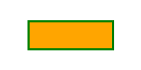

# g<sup>2</sup>

g<sup>2</sup> is a 2D graphics javascript library based on the [command pattern](http://addyosmani.com/resources/essentialjsdesignpatterns/book/#commandpatternjavascript) 
principle. Its main goal is to provide a simple API for users who want to generate 2D web graphics occasionally. 
So the API is minimal and easy to understand. The library is tiny, fast and renderer agnostic.

## Main features

* Fast and lightweight graphics command queue builder.
* Adressing HTML canvas 2D context as the default renderer.
* Generating SVG output using an [addon library](https://github.com/goessner/g2-svg).
* Method chaining.
* Support of cartesian coordinates.
* Viewport pan and zoom transformations.
* Low level path commands with short names adopted from SVG.
* Higher level element commands.
* Maintaining a state stack for styling and transformations.
* Easy way to build custom symbol libraries.
* Tiny footprint by 5kB compressed (gzip).
* No dependency.

## Minimal Example

```html
<canvas id="c" width="200", height="100"></canvas>
<script src="g2.js"></script>
<script>
    g2().rec(40,30,120,40,{ls:"green",fs:"orange",lw:3})  // create g2 object and add rectangle with style.
        .exe(document.getElementById("c").getContext("2d"));  // draw to canvas.
</script>
```


## Documentation
  * [Getting started](../../wiki/getting-started)
  * [Concepts](../../wiki/concepts)
  * [Paths](../../wiki/paths)
  * [Elements](../../wiki/elements)
  * [State and Style](../../wiki/state-and-style)
  * [Reuse](../../wiki/reuse)
  * [View](../../wiki/view)
  * [Animation](../../wiki/animation)
  * [Interactivity](../../wiki/interactivity)


## API Reference
See the [API Reference](api/README.md) for details.


## GitCDN
Use the link [https://gitcdn.xyz/repo/goessner/g2/master/g2.min.js](https://gitcdn.xyz/repo/goessner/g2/master/g2.min.js)
for getting the latest commit as a rwa file.

In HTML use ...
```html
<script src="https://gitcdn.xyz/repo/goessner/g2/master/g2.min.js"></script>
```


## Cheat Sheet
Check out the single page [Cheat Sheet](api/sheet.pdf).


# License
g<sup>2</sup> is licensed under the terms of the MIT License.


#Change Log

## 2.1.1 - 2016-05-15

### Modified

* `g2.cor.js` + `g2.c2d.js` => `g2.js`  (reunited).
* `g2.context` namespace introduced.

## 2.1.0 - 2016-01-17

### Added

* `style` argument for elements `lin`,`rec`,`cir`,`arc`,`ply`.
* `style` as first argument for `stroke`,`fill` and `drw`, optionally followed by a svg path definition string.

### Changed

* State stack reimplemented.


## 1.1.0 - 2016-01-08

### Added

  CHANGELOG.md @goessner.


