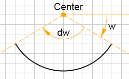

<a name="g2"></a>
## g2()
Create a queue of 2D graphics commands.

**Kind**: global function  
**Example**  
```js
// How to use g2()
var ctx = document.getElementById("c").getContext("2d");
g2()                  // Create 'g2' instance.
 .lin(50,50,100,100)  // Append ...
 .lin(100,100,200,50) // ... commands.
 .exe(ctx);           // Execute commands addressing canvas context.
```

* [g2()](#g2)
    * _instance_
        * [.cartesian()](#g2+cartesian) ⇒ <code>object</code>
        * [.pan(dx, dy)](#g2+pan) ⇒ <code>object</code>
        * [.zoom(scl, [x], [y])](#g2+zoom) ⇒ <code>object</code>
        * [.p()](#g2+p) ⇒ <code>object</code>
        * [.m(x, y)](#g2+m) ⇒ <code>object</code>
        * [.l(x, y)](#g2+l) ⇒ <code>object</code>
        * [.q(x1, y1, x, y)](#g2+q) ⇒ <code>object</code>
        * [.c(x1, y1, x2, y2, x, y)](#g2+c) ⇒ <code>object</code>
        * [.a(dw, x, y)](#g2+a) ⇒ <code>object</code>
        * [.z()](#g2+z) ⇒ <code>object</code>
        * [.stroke([d])](#g2+stroke) ⇒ <code>object</code>
        * [.fill([d])](#g2+fill) ⇒ <code>object</code>
        * [.drw([d])](#g2+drw) ⇒ <code>object</code>
        * [.txt(s, [x], [y], [w], [style])](#g2+txt) ⇒ <code>object</code>
        * [.img(uri, [x], [y], [b], [h], [xoff], [yoff], [dx], [dy])](#g2+img) ⇒ <code>object</code>
        * [.lin(x1, y1, x2, y2)](#g2+lin) ⇒ <code>object</code>
        * [.rec(x, y, b, h)](#g2+rec) ⇒ <code>object</code>
        * [.cir(x, y, r)](#g2+cir) ⇒ <code>object</code>
        * [.arc(x, y, r, [w], [dw])](#g2+arc) ⇒ <code>object</code>
        * [.ply(parr, [mode], [itr])](#g2+ply) ⇒ <code>object</code>
        * [.beg(args)](#g2+beg) ⇒ <code>object</code>
        * [.end()](#g2+end) ⇒ <code>object</code>
        * [.clr()](#g2+clr) ⇒ <code>object</code>
        * [.grid([color], [size])](#g2+grid) ⇒ <code>object</code>
        * [.use(g, args)](#g2+use) ⇒ <code>object</code>
        * [.style(args)](#g2+style) ⇒ <code>object</code>
        * [.exe(ctx, [g])](#g2+exe) ⇒ <code>object</code>
        * [.cpy(g)](#g2+cpy) ⇒ <code>object</code>
        * [.del()](#g2+del) ⇒ <code>object</code>
        * [.pntToUsr(x, y, [h])](#g2+pntToUsr) ⇒ <code>object</code>
        * [.vecToUsr(x, y)](#g2+vecToUsr) ⇒ <code>object</code>
        * [.dump([space])](#g2+dump) ⇒ <code>string</code>
    * _static_
        * [.symbol](#g2.symbol) : <code>object</code>
        * [.version](#g2.version) : <code>string</code>

<a name="g2+cartesian"></a>
### g2.cartesian() ⇒ <code>object</code>
Set the view cartesian mode.

**Kind**: instance method of <code>[g2](#g2)</code>  
**Returns**: <code>object</code> - g2  
<a name="g2+pan"></a>
### g2.pan(dx, dy) ⇒ <code>object</code>
Pan the view by a displacement vector.

**Kind**: instance method of <code>[g2](#g2)</code>  
**Returns**: <code>object</code> - g2  

| Param | Type | Description |
| --- | --- | --- |
| dx | <code>float</code> | pan x-value in device units. |
| dy | <code>float</code> | pan y-value in device units. |

<a name="g2+zoom"></a>
### g2.zoom(scl, [x], [y]) ⇒ <code>object</code>
Zoom the view by a scaling factor with respect to given center.

**Kind**: instance method of <code>[g2](#g2)</code>  
**Returns**: <code>object</code> - g2  

| Param | Type | Default | Description |
| --- | --- | --- | --- |
| scl | <code>float</code> |  | Relative scaling factor. |
| [x] | <code>float</code> | <code>0</code> | x-component of zoom center in device units. |
| [y] | <code>float</code> | <code>0</code> | y-component of zoom center in device units. |

<a name="g2+p"></a>
### g2.p() ⇒ <code>object</code>
Begin new path.

**Kind**: instance method of <code>[g2](#g2)</code>  
**Returns**: <code>object</code> - g2  
<a name="g2+m"></a>
### g2.m(x, y) ⇒ <code>object</code>
Move to point.

**Kind**: instance method of <code>[g2](#g2)</code>  
**Returns**: <code>object</code> - g2  

| Param | Type | Description |
| --- | --- | --- |
| x | <code>float</code> | Move to x coordinate |
| y | <code>float</code> | Move to y coordinate |

<a name="g2+l"></a>
### g2.l(x, y) ⇒ <code>object</code>
Create line segment to point.

**Kind**: instance method of <code>[g2](#g2)</code>  
**Returns**: <code>object</code> - g2  

| Param | Type | Description |
| --- | --- | --- |
| x | <code>float</code> | x coordinate of target point. |
| y | <code>float</code> | y coordinate of target point. |

**Example**  
```js
g2().p()          // Begin path.
    .m(0,50)      // Move to point.
    .l(300,0)     // Line segment to point.
    .l(400,100)   // ...
    .stroke()     // Stroke path.
    .exe(ctx);    // Render to context.
```
<a name="g2+q"></a>
### g2.q(x1, y1, x, y) ⇒ <code>object</code>
Create quadratic bezier curve segment to point.  


**Kind**: instance method of <code>[g2](#g2)</code>  
**Returns**: <code>object</code> - g2  

| Param | Type | Description |
| --- | --- | --- |
| x1 | <code>float</code> | x coordinate of control point. |
| y1 | <code>float</code> | y coordinate of control point. |
| x | <code>float</code> | x coordinate of target point. |
| y | <code>float</code> | y coordinate of target point. |

**Example**  
```js
g2().p()               // Begin path.
    .m(0,0)            // Move to point.
    .q(200,200,400,0)  // Quadratic bezier curve segment.
    .stroke()          // Stroke path.
    .exe(ctx);         // Render to context.
```
<a name="g2+c"></a>
### g2.c(x1, y1, x2, y2, x, y) ⇒ <code>object</code>
Create cubic bezier curve to point.  


**Kind**: instance method of <code>[g2](#g2)</code>  
**Returns**: <code>object</code> - g2  

| Param | Type | Description |
| --- | --- | --- |
| x1 | <code>float</code> | x coordinate of first control point. |
| y1 | <code>float</code> | y coordinate of first control point. |
| x2 | <code>float</code> | x coordinate of second control point. |
| y2 | <code>float</code> | y coordinate of second control point. |
| x | <code>float</code> | x coordinate of target point. |
| y | <code>float</code> | y coordinate of target point. |

**Example**  
```js
g2().p()                        // Begin path.
    .m(0,100)                   // Move to point.
    .c(100,200,200,0,400,100)   // Create cubic bezier curve.
    .stroke()                   // Stroke path.
    .exe(ctx);                  // Render to canvas context.
```
<a name="g2+a"></a>
### g2.a(dw, x, y) ⇒ <code>object</code>
Draw arc with angular range to target point.  


**Kind**: instance method of <code>[g2](#g2)</code>  
**Returns**: <code>object</code> - g2  

| Param | Type | Description |
| --- | --- | --- |
| dw | <code>float</code> | Angular range in radians. |
| x | <code>float</code> | x coordinate of target point. |
| y | <code>float</code> | y coordinate of target point. |

**Example**  
```js
var g = g2();    // Create g2 object.
g2().p()            // Begin path.
    .m(50,50)       // Move to point.
    .a(2,300,100)   // Create cubic bezier curve.
    .stroke()       // Stroke path.
    .exe(ctx);      // Render to canvas context.
```
<a name="g2+z"></a>
### g2.z() ⇒ <code>object</code>
Close current path by straigth line.

**Kind**: instance method of <code>[g2](#g2)</code>  
**Returns**: <code>object</code> - g2  
<a name="g2+stroke"></a>
### g2.stroke([d]) ⇒ <code>object</code>
Stroke the current path or path object.

**Kind**: instance method of <code>[g2](#g2)</code>  
**Returns**: <code>object</code> - g2  

| Param | Type | Description |
| --- | --- | --- |
| [d] | <code>string</code> | SVG path definition string. |

<a name="g2+fill"></a>
### g2.fill([d]) ⇒ <code>object</code>
Fill the current path or path object.

**Kind**: instance method of <code>[g2](#g2)</code>  
**Returns**: <code>object</code> - g2  

| Param | Type | Description |
| --- | --- | --- |
| [d] | <code>string</code> | SVG path definition string. |

<a name="g2+drw"></a>
### g2.drw([d]) ⇒ <code>object</code>
Shortcut for stroke and fill the current path or path object.
In case of shadow, only the path interior creates shadow, not also the path contour.

**Kind**: instance method of <code>[g2](#g2)</code>  
**Returns**: <code>object</code> - g2  

| Param | Type | Description |
| --- | --- | --- |
| [d] | <code>string</code> | SVG path definition string. |

<a name="g2+txt"></a>
### g2.txt(s, [x], [y], [w], [style]) ⇒ <code>object</code>
Draw text string at anchor point.

**Kind**: instance method of <code>[g2](#g2)</code>  
**Returns**: <code>object</code> - g2  

| Param | Type | Default | Description |
| --- | --- | --- | --- |
| s | <code>string</code> |  | Text string. |
| [x] | <code>float</code> | <code>0</code> | x coordinate of text anchor position. |
| [y] | <code>float</code> | <code>0</code> | y coordinate of text anchor position. |
| [w] | <code>float</code> | <code>0</code> | w Rotation angle about anchor point with respect to positive x-axis. |
| [style] | <code>object</code> |  | args Object with styling values. |

<a name="g2+img"></a>
### g2.img(uri, [x], [y], [b], [h], [xoff], [yoff], [dx], [dy]) ⇒ <code>object</code>
Draw image. The command queue will not be executed until all images have been completely loaded.
This also applies to images of reused g2 objects. If an image can not be loaded, it will be replaced by a broken-image symbol.

**Kind**: instance method of <code>[g2](#g2)</code>  
**Returns**: <code>object</code> - g2  

| Param | Type | Default | Description |
| --- | --- | --- | --- |
| uri | <code>string</code> |  | Image uri or data:url. |
| [x] | <code>float</code> | <code>0</code> | X-coordinate of image (upper left). |
| [y] | <code>float</code> | <code>0</code> | Y-coordinate of image (upper left). |
| [b] | <code>float</code> |  | Width. |
| [h] | <code>float</code> |  | Height. |
| [xoff] | <code>float</code> |  | X-offset. |
| [yoff] | <code>float</code> |  | Y-offset. |
| [dx] | <code>float</code> |  | Region x. |
| [dy] | <code>float</code> |  | Region y. |

<a name="g2+lin"></a>
### g2.lin(x1, y1, x2, y2) ⇒ <code>object</code>
Draw line by start point and end point.

**Kind**: instance method of <code>[g2](#g2)</code>  
**Returns**: <code>object</code> - g2  

| Param | Type | Description |
| --- | --- | --- |
| x1 | <code>float</code> | Start x coordinate. |
| y1 | <code>float</code> | Start y coordinate. |
| x2 | <code>float</code> | End x coordinate. |
| y2 | <code>float</code> | End y coordinate. |

**Example**  
```js
g2().lin(10,10,190,10)  // Draw line.
    .exe(ctx);          // Render to context.
```
<a name="g2+rec"></a>
### g2.rec(x, y, b, h) ⇒ <code>object</code>
Draw rectangle by anchor point and dimensions.

**Kind**: instance method of <code>[g2](#g2)</code>  
**Returns**: <code>object</code> - g2  

| Param | Type | Description |
| --- | --- | --- |
| x | <code>float</code> | x-value upper left corner. |
| y | <code>float</code> | y-value upper left corner. |
| b | <code>float</code> | Width. |
| h | <code>float</code> | Height. |

**Example**  
```js
g2().rec(100,80,40,30)  // Draw rectangle.
    .exe(ctx);          // Render to context.
```
<a name="g2+cir"></a>
### g2.cir(x, y, r) ⇒ <code>object</code>
Draw circle by center and radius.

**Kind**: instance method of <code>[g2](#g2)</code>  
**Returns**: <code>object</code> - g2  

| Param | Type | Description |
| --- | --- | --- |
| x | <code>float</code> | x-value center. |
| y | <code>float</code> | y-value center. |
| r | <code>float</code> | Radius. |

**Example**  
```js
g2().cir(100,80,20)  // Draw circle.
    .exe(ctx);       // Render to context.
```
<a name="g2+arc"></a>
### g2.arc(x, y, r, [w], [dw]) ⇒ <code>object</code>
Draw arc by center point, radius, start angle and angular range.<br>


**Kind**: instance method of <code>[g2](#g2)</code>  
**Returns**: <code>object</code> - g2  

| Param | Type | Default | Description |
| --- | --- | --- | --- |
| x | <code>float</code> |  | x-value center. |
| y | <code>float</code> |  | y-value center. |
| r | <code>float</code> |  | Radius. |
| [w] | <code>float</code> | <code>0</code> | Start angle (in radian). |
| [dw] | <code>float</code> | <code>2*pi</code> | Angular range in Radians. |

**Example**  
```js
g2().arc(300,400,390,-Math.PI/4,-Math.PI/2)
    .exe(ctx);
```
<a name="g2+ply"></a>
### g2.ply(parr, [mode], [itr]) ⇒ <code>object</code>
Draw polygon by points.
Using iterator function for getting points from array by index.
It must return current point object {x,y} or object {done:true}.
Default iterator expects sequence of x/y-coordinates as a flat array [x,y,...],
array of [[x,y],...] arrays or array of [{x,y},...] objects.

**Kind**: instance method of <code>[g2](#g2)</code>  
**Returns**: <code>object</code> - this  

| Param | Type | Default | Description |
| --- | --- | --- | --- |
| parr | <code>array</code> |  | Array of points. |
| [mode] | <code>bool</code> &#124; <code>&#x27;split&#x27;</code> | <code>false</code> | true:closed, false:non-closed, 'split:intermittend lines. |
| [itr] | <code>function</code> |  | Iterator function getting array and point index as parameters. |

**Example**  
```js
g2().ply([100,50,120,60,80,70]),
    .ply([150,60],[170,70],[130,80]],true),
    .ply({x:160,y:70},{x:180,y:80},{x:140,y:90}],'split'),
    .exe(ctx);
```
<a name="g2+beg"></a>
### g2.beg(args) ⇒ <code>object</code>
Begin subcommands. Current state is saved. 
Optionally apply transformation or style properties.

**Kind**: instance method of <code>[g2](#g2)</code>  
**Returns**: <code>object</code> - g2  

| Param | Type | Default | Description |
| --- | --- | --- | --- |
| args | <code>object</code> |  | Arguments object. |
| [args.x] | <code>float</code> | <code>0</code> | Translation value x. |
| [args.y] | <code>float</code> | <code>0</code> | Translation value y. |
| [args.w] | <code>float</code> | <code>0</code> | Rotation angle (in radians). |
| [args.scl] | <code>float</code> | <code>1</code> | Scale factor. |
| [args.matrix] | <code>array</code> |  | Matrix instead of single transform arguments (SVG-structure [a,b,c,d,x,y]). |
| [args.style] | <code>any</code> |  | Style property. See 'g2.style' for details. |

<a name="g2+end"></a>
### g2.end() ⇒ <code>object</code>
End subcommands. Previous state is restored.

**Kind**: instance method of <code>[g2](#g2)</code>  
**Returns**: <code>object</code> - g2  
<a name="g2+clr"></a>
### g2.clr() ⇒ <code>object</code>
Clear viewport.

**Kind**: instance method of <code>[g2](#g2)</code>  
**Returns**: <code>object</code> - g2  
<a name="g2+grid"></a>
### g2.grid([color], [size]) ⇒ <code>object</code>
Draw grid.

**Kind**: instance method of <code>[g2](#g2)</code>  
**Returns**: <code>object</code> - g2  

| Param | Type | Default | Description |
| --- | --- | --- | --- |
| [color] | <code>string</code> | <code>&quot;#ccc&quot;</code> | CSS grid color. |
| [size] | <code>float</code> |  | Grid size. |

<a name="g2+use"></a>
### g2.use(g, args) ⇒ <code>object</code>
Reference g2 graphics commands from another g2 object.
With this command you can reuse instances of grouped graphics commands
while applying a similarity transformation and style properties on them.
In fact you might want to build custom graphics libraries on top of that feature.

**Kind**: instance method of <code>[g2](#g2)</code>  
**Returns**: <code>object</code> - g2  

| Param | Type | Default | Description |
| --- | --- | --- | --- |
| g | <code>object</code> &#124; <code>string</code> |  | g2 source object or symbol name found in 'g2.symbol' namespace. |
| args | <code>object</code> |  | Arguments object. |
| [args.x] | <code>float</code> | <code>0</code> | Translation value x. |
| [args.y] | <code>float</code> | <code>0</code> | Translation value y. |
| [args.w] | <code>float</code> | <code>0</code> | Rotation angle (in radians). |
| [args.scl] | <code>float</code> | <code>1</code> | Scale factor. |
| [args.matrix] | <code>array</code> |  | Matrix instead of single transform arguments (SVG-structure [a,b,c,d,x,y]). |
| [args.style] | <code>any</code> |  | Style property. See 'g2.style' for details. |

**Example**  
```js
g2.symbol.cross = g2().lin(5,5,-5,-5).lin(5,-5,-5,5);  // Define symbol.
g2().use("cross",{x:100,y:100})  // Draw cross at position 100,100.
    .exe(ctx);                   // Render to context.
```
<a name="g2+style"></a>
### g2.style(args) ⇒ <code>object</code>
Apply new style properties.

**Kind**: instance method of <code>[g2](#g2)</code>  
**Returns**: <code>object</code> - g2  

| Param | Type | Default | Description |
| --- | --- | --- | --- |
| args | <code>object</code> |  | Style properties object. |
| [args.fs] | <code>string</code> | <code>&quot;transparent&quot;</code> | Fill color (fillStyle). |
| [args.ls] | <code>string</code> | <code>&quot;black&quot;</code> | Line color (lineStroke). |
| [args.lw] | <code>float</code> | <code>1</code> | Line width. |
| [args.lc] | <code>string</code> | <code>&quot;butt&quot;</code> | Line cap [`butt`, `round`, `square`]. |
| [args.lj] | <code>string</code> | <code>&quot;miter&quot;</code> | Line join [`round`, `bevel` and `miter`]. |
| [args.ml] | <code>float</code> | <code>10</code> | Miter limit'. |
| [args.ld] | <code>array</code> | <code>[]</code> | Line dash array. |
| [args.lo] | <code>int</code> | <code>0</code> | Line dash offset. |
| [args.sh] | <code>array</code> | <code>[0,0,0,&quot;transparent&quot;&quot;]</code> | Shadow values array [x-offset,y-offset,blur,color]. |
| [args.thal] | <code>string</code> | <code>&quot;start&quot;</code> | Text horizontal alignment ['start', 'end', 'left', 'right' or 'center']. |
| [args.tval] | <code>string</code> | <code>&quot;alphabetic&quot;</code> | Text vertical alignment ['top', 'hanging', 'middle', 'alphabetic', 'ideographic', 'bottom']. |
| [args.fof] | <code>string</code> | <code>&quot;serif&quot;</code> | Font family ['serif', 'sans-serif', 'monospace', 'cursive', 'fantasy', 'arial', 'verdana', ... ] s. CSS |
| [args.foz] | <code>float</code> | <code>12</code> | Font size. |
| [args.foc] | <code>string</code> | <code>&quot;black&quot;</code> | Font color. |
| [args.fow] | <code>string</code> | <code>&quot;normal&quot;</code> | Font weight ['normal','bold','lighter','bolder',100,200,...,900]. |
| [args.fos] | <code>string</code> | <code>&quot;normal&quot;</code> | Font style ['normal','italic','oblique']. |

**Example**  
```js
g = g2();
g2().style({ fs:"#58dbfa",         // Set fill style.
             lw:10,                // Set line width.
             ls:"#313942",         // Set line style.
             lj:"round" })         // Set line join.
    .rec(10,10,300,100)
    .style({ lw:20,                // Set line width.
             fs:"transparent",     // Set fill style.
             sh:[10,0,10,"black"], // Set shadow x-translation.
             ld:[1,2] })           // Set line dash.
    .p().m(40,40).c(150,150,200,0,280,50).drw()
    .exe(ctx);
```
<a name="g2+exe"></a>
### g2.exe(ctx, [g]) ⇒ <code>object</code>
Execute g2 commands. It does so automatically and recursively with 'use'ed commands.

**Kind**: instance method of <code>[g2](#g2)</code>  
**Returns**: <code>object</code> - g2  

| Param | Type | Default | Description |
| --- | --- | --- | --- |
| ctx | <code>object</code> |  | Context. |
| [g] | <code>object</code> | <code>this</code> | g2 Object to execute. This argument is set by 'g2' and usually not by the user. |

<a name="g2+cpy"></a>
### g2.cpy(g) ⇒ <code>object</code>
Copy all g2 graphics commands from a g2 object.
If the source object is 'this', nothing is done.

**Kind**: instance method of <code>[g2](#g2)</code>  
**Returns**: <code>object</code> - g2  

| Param | Type | Description |
| --- | --- | --- |
| g | <code>object</code> | g2 source object to copy commands from. |

**Example**  
```js
var smiley = g2().cir(60,60,50).cir(40,40,10).cir(80,40,10).arc(60,60,30,0.8,2);
g2().style({lw:8,fs:"yellow"})
    .cpy(smiley)  // Copy all commands from 'smiley'.
    .exe(ctx);
```
**Example**  
```js
function smiley(g) {
   // do some calculations ...
   return g.cir(60,60,50).cir(40,40,10).cir(80,40,10).arc(60,60,30,0.8,2);
}
var g = g2();
g.style({lw:8,fs:"yellow"})
 .cpy(smiley(g))  // invoke smiley here in method chain.
 .exe(ctx);
```
<a name="g2+del"></a>
### g2.del() ⇒ <code>object</code>
Delete all commands.

**Kind**: instance method of <code>[g2](#g2)</code>  
**Returns**: <code>object</code> - g2  
<a name="g2+pntToUsr"></a>
### g2.pntToUsr(x, y, [h]) ⇒ <code>object</code>
Get user coordinates from device coordinates for point.

**Kind**: instance method of <code>[g2](#g2)</code>  
**Returns**: <code>object</code> - User coordinates  {x, y}  

| Param | Type | Description |
| --- | --- | --- |
| x | <code>float</code> | x-value in device units. |
| y | <code>float</code> | y-value in device units. |
| [h] | <code>float</code> | Viewport (canvas) height in device units. Only needed in cartesian coordinate system. |

<a name="g2+vecToUsr"></a>
### g2.vecToUsr(x, y) ⇒ <code>object</code>
Get user coordinates from device coordinates for unbound vector.

**Kind**: instance method of <code>[g2](#g2)</code>  
**Returns**: <code>object</code> - User coordinates {x, y}  

| Param | Type | Description |
| --- | --- | --- |
| x | <code>float</code> | x-value in device units. |
| y | <code>float</code> | y-value in device units. |

<a name="g2+dump"></a>
### g2.dump([space]) ⇒ <code>string</code>
Debug helper method.
Convert g2 command queue to JSON formatted string.

**Kind**: instance method of <code>[g2](#g2)</code>  
**Returns**: <code>string</code> - JSON string of command queue.  

| Param | Type | Description |
| --- | --- | --- |
| [space] | <code>string</code> | Number of spaces to use for indenting JSON output. |

<a name="g2.symbol"></a>
### g2.symbol : <code>object</code>
Namespace for symbol objects. A symbol can be used by `use("symbolname")`.

**Kind**: static property of <code>[g2](#g2)</code>  
**Example**  
```js
g2.symbol.cross = g2().lin(5,5,-5,-5).lin(5,-5,-5,5);  // Define symbol.
g2().use("cross",{x:100,y:100})  // Draw cross at position 100,100.
    .exe(ctx);                   // Render to context.
```
<a name="g2.version"></a>
### g2.version : <code>string</code>
Current version.
Using semantic versioning 'http://semver.org/'.

**Kind**: static constant of <code>[g2](#g2)</code>  
