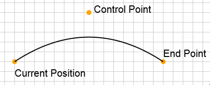
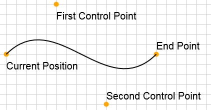
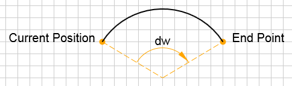

<a name="g2"></a>
## g2([args])
Maintains a queue of 2D graphics commands.

**Kind**: global function  

| Param | Type | Description |
| --- | --- | --- |
| [args] | <code>object</code> | Arguments object with one or more members. |
| [args.cartesian] | <code>bool</code> | Set cartesian coordinates. |
| [args.pan] | <code>object</code> |  |
| [args.pan.dx] | <code>float</code> | Pan in x. |
| [args.pan.dy] | <code>float</code> | Pan in y. |
| [args.zoom] | <code>object</code> |  |
| [args.zoom.x] | <code>float</code> | Zoom center x. |
| [args.zoom.y] | <code>float</code> | Zoom center y. |
| [args.zoom.scl] | <code>float</code> | Zoom factor. |
| [args.trf] | <code>object</code> |  |
| [args.trf.x] | <code>float</code> | Transform in x. |
| [args.trf.y] | <code>float</code> | Transform in y. |
| [args.trf.scl] | <code>float</code> | Zoom factor. |

**Example**  
```js
// How to use g2()
var ctx = document.getElementById("c").getContext("2d"); // Get your canvas context.
g2()                  // The first call of g2() creates a g2 object.
 .lin(50,50,100,100)  // Append commands.
 .lin(100,100,200,50)
 .exe(ctx);           // Execute commands.
```

* [g2([args])](#g2)
  * _instance_
    * [.cartesian()](#g2+cartesian) ⇒ <code>object</code>
    * [.pan(dx, dy)](#g2+pan) ⇒ <code>object</code>
    * [.zoom(scl, [x], [y])](#g2+zoom) ⇒ <code>object</code>
    * [.trf(x, y, scl)](#g2+trf) ⇒ <code>object</code>
    * [.pntToUsr(x, y, h)](#g2+pntToUsr) ⇒ <code>object</code>
    * [.vecToUsr(x, y)](#g2+vecToUsr) ⇒ <code>object</code>
    * [.p()](#g2+p) ⇒ <code>object</code>
    * [.m(x, y)](#g2+m) ⇒ <code>object</code>
    * [.l(x, y)](#g2+l) ⇒ <code>object</code>
    * [.q(x1, y1, x, y)](#g2+q) ⇒ <code>object</code>
    * [.c(x1, y1, x2, y2, x, y)](#g2+c) ⇒ <code>object</code>
    * [.a(dw, x, y)](#g2+a) ⇒ <code>object</code>
    * [.z()](#g2+z) ⇒ <code>object</code>
    * [.stroke([p])](#g2+stroke) ⇒ <code>object</code>
    * [.fill([p])](#g2+fill) ⇒ <code>object</code>
    * [.drw([p])](#g2+drw) ⇒ <code>object</code>
    * [.txt(s, [x], [y], [maxWidth])](#g2+txt) ⇒ <code>object</code>
    * [.img(uri, [x], [y], [b], [h], [xoff], [yoff], [dx], [dy])](#g2+img) ⇒ <code>object</code>
    * [.lin(x1, y1, x2, y2)](#g2+lin) ⇒ <code>object</code>
    * [.rec(x, y, b, h)](#g2+rec) ⇒ <code>object</code>
    * [.cir(x, y, r)](#g2+cir) ⇒ <code>object</code>
    * [.arc(x, y, r, [w], [dw])](#g2+arc) ⇒ <code>object</code>
    * [.ply(parr, [closed], [opts])](#g2+ply) ⇒ <code>object</code>
    * [.beg(x, y, w, scl)](#g2+beg) ⇒ <code>object</code>
    * [.end()](#g2+end) ⇒ <code>object</code>
    * [.clr()](#g2+clr) ⇒ <code>object</code>
    * [.grid([color], [size])](#g2+grid) ⇒ <code>object</code>
    * [.use(g, [x], [y], [w], [scl])](#g2+use) ⇒ <code>object</code>
    * [.style(args)](#g2+style) ⇒ <code>object</code>
    * [.exe(ctx, [g])](#g2+exe) ⇒ <code>object</code>
    * [.cpy(g)](#g2+cpy) ⇒ <code>object</code>
    * [.del()](#g2+del) ⇒ <code>object</code>
    * [.dump([space])](#g2+dump) ⇒ <code>string</code>
  * _static_
    * [.symbol](#g2.symbol) : <code>object</code>
    * [.version](#g2.version) : <code>string</code>

<a name="g2+cartesian"></a>
### g2.cartesian() ⇒ <code>object</code>
Set cartesian coordinates mode within a viewport.

**Kind**: instance method of <code>[g2](#g2)</code>  
**Returns**: <code>object</code> - g2  
<a name="g2+pan"></a>
### g2.pan(dx, dy) ⇒ <code>object</code>
Pan a distance within a viewport.

**Kind**: instance method of <code>[g2](#g2)</code>  
**Returns**: <code>object</code> - g2  

| Param | Type | Description |
| --- | --- | --- |
| dx | <code>float</code> | x-component to pan. |
| dy | <code>float</code> | y-component to pan. |

<a name="g2+zoom"></a>
### g2.zoom(scl, [x], [y]) ⇒ <code>object</code>
Zoom within a viewport.

**Kind**: instance method of <code>[g2](#g2)</code>  
**Returns**: <code>object</code> - g2  

| Param | Type | Default | Description |
| --- | --- | --- | --- |
| scl | <code>float</code> |  | Scaling factor. |
| [x] | <code>float</code> | <code>0</code> | x-component of zoom center. |
| [y] | <code>float</code> | <code>0</code> | y-component of zoom center. |

<a name="g2+trf"></a>
### g2.trf(x, y, scl) ⇒ <code>object</code>
Set transform directly within a viewport.

**Kind**: instance method of <code>[g2](#g2)</code>  
**Returns**: <code>object</code> - g2  

| Param | Type | Description |
| --- | --- | --- |
| x | <code>float</code> | x-translation. |
| y | <code>float</code> | y-translation. |
| scl | <code>float</code> | Scaling factor. |

<a name="g2+pntToUsr"></a>
### g2.pntToUsr(x, y, h) ⇒ <code>object</code>
Get user coordinates from canvas coordinates for point (with respect to initial transform).

**Kind**: instance method of <code>[g2](#g2)</code>  
**Returns**: <code>object</code> - User coordinates  {x, y}  

| Param | Type | Description |
| --- | --- | --- |
| x | <code>float</code> | x-translation. |
| y | <code>float</code> | y-translation. |
| h | <code>float</code> | Viewport (canvas) height. Only needed in cartesian coordinate system. |

<a name="g2+vecToUsr"></a>
### g2.vecToUsr(x, y) ⇒ <code>object</code>
Get user coordinates from canvas coordinates for direction vector (with respect to initial transform).

**Kind**: instance method of <code>[g2](#g2)</code>  
**Returns**: <code>object</code> - User coordinates {x, y}  

| Param | Type | Description |
| --- | --- | --- |
| x | <code>float</code> | x-translation. |
| y | <code>float</code> | y-translation. |

<a name="g2+p"></a>
### g2.p() ⇒ <code>object</code>
Begin new path.

**Kind**: instance method of <code>[g2](#g2)</code>  
**Returns**: <code>object</code> - g2  
<a name="g2+m"></a>
### g2.m(x, y) ⇒ <code>object</code>
Move to point.

**Kind**: instance method of <code>[g2](#g2)</code>  
**Returns**: <code>object</code> - g2  

| Param | Type | Description |
| --- | --- | --- |
| x | <code>float</code> &#124; <code>array</code> &#124; <code>object</code> | Point x coordinate |
| y | <code>float</code> &#124; <code>undefined</code> | Point y coordinate |

<a name="g2+l"></a>
### g2.l(x, y) ⇒ <code>object</code>
Create line to point.

**Kind**: instance method of <code>[g2](#g2)</code>  
**Returns**: <code>object</code> - g2  

| Param | Type | Description |
| --- | --- | --- |
| x | <code>float</code> | Point x coordinate. |
| y | <code>float</code> | Point y coordinate. |

**Example**  
```js
var g = g2();  // Create g2 object.
g.p()          // Begin path.
 .m(0,50)      // Move to point.
 .l(300,0)     // Create line to point.
 .l(400,100)   // ...
 .stroke()     // Stroke path.
 .exe(ctx);    // Render to canvas context.
```
<a name="g2+q"></a>
### g2.q(x1, y1, x, y) ⇒ <code>object</code>
Create quadratic bezier curve to point.  

**Kind**: instance method of <code>[g2](#g2)</code>  
**Returns**: <code>object</code> - g2  

| Param | Type | Description |
| --- | --- | --- |
| x1 | <code>float</code> | x coordinate of control point. |
| y1 | <code>float</code> | y coordinate of control point. |
| x | <code>float</code> | x coordinate of point. |
| y | <code>float</code> | y coordinate of point. |

**Example**  
```js
var g = g2();       // Create g2 object.
g.p()               // Begin path.
 .m(0,0)            // Move to point.
 .q(200,200,400,0)  // Create quadratic bezier curve.
 .stroke()          // Stroke path.
 .exe(ctx);         // Render to canvas context.
```
<a name="g2+c"></a>
### g2.c(x1, y1, x2, y2, x, y) ⇒ <code>object</code>
Create cubic bezier curve to point.  

**Kind**: instance method of <code>[g2](#g2)</code>  
**Returns**: <code>object</code> - g2  

| Param | Type | Description |
| --- | --- | --- |
| x1 | <code>float</code> | x coordinate of first control point. |
| y1 | <code>float</code> | y coordinate of first control point. |
| x2 | <code>float</code> | x coordinate of second control point. |
| y2 | <code>float</code> | y coordinate of second control point. |
| x | <code>float</code> | x coordinate of endpoint. |
| y | <code>float</code> | y coordinate of endpoint. |

**Example**  
```js
var g = g2();                // Create g2 object.
g.p()                        // Begin path.
 .m(0,100)                   // Move to point.
 .c(100,200,200,0,400,100)   // Create cubic bezier curve.
 .stroke()                   // Stroke path.
 .exe(ctx);                  // Render to canvas context.
```
<a name="g2+a"></a>
### g2.a(dw, x, y) ⇒ <code>object</code>
Draw arc with angular range dw to point.  

**Kind**: instance method of <code>[g2](#g2)</code>  
**Returns**: <code>object</code> - g2  

| Param | Type | Description |
| --- | --- | --- |
| dw | <code>float</code> | Angle in radians. Can be positive or negative. |
| x | <code>float</code> | x coordinate of endpoint. |
| y | <code>float</code> | y coordinate of endpoint. |

**Example**  
```js
var g = g2();    // Create g2 object.
g.p()            // Begin path.
 .m(50,50)       // Move to point.
 .a(2,300,100)   // Create cubic bezier curve.
 .stroke()       // Stroke path.
 .exe(ctx);      // Render to canvas context.
```
<a name="g2+z"></a>
### g2.z() ⇒ <code>object</code>
Close current path.

**Kind**: instance method of <code>[g2](#g2)</code>  
**Returns**: <code>object</code> - g2  
<a name="g2+stroke"></a>
### g2.stroke([p]) ⇒ <code>object</code>
Stroke the current path or path object.

**Kind**: instance method of <code>[g2](#g2)</code>  
**Returns**: <code>object</code> - g2  

| Param | Type | Description |
| --- | --- | --- |
| [p] | <code>object</code> | Path2D object |

<a name="g2+fill"></a>
### g2.fill([p]) ⇒ <code>object</code>
Fill the current path or path object.

**Kind**: instance method of <code>[g2](#g2)</code>  
**Returns**: <code>object</code> - g2  

| Param | Type | Description |
| --- | --- | --- |
| [p] | <code>object</code> | Path2D object |

<a name="g2+drw"></a>
### g2.drw([p]) ⇒ <code>object</code>
Shortcut for stroke and fill the current path or path object.
In case of shadow, only the path interior creates shadow, not the path contour additionally.

**Kind**: instance method of <code>[g2](#g2)</code>  
**Returns**: <code>object</code> - g2  

| Param | Type | Description |
| --- | --- | --- |
| [p] | <code>object</code> | Path2D object |

<a name="g2+txt"></a>
### g2.txt(s, [x], [y], [maxWidth]) ⇒ <code>object</code>
Draw text.
Using ctx.fillText if 'fontColor' is not 'transparent', else ctx.strokeText.

**Kind**: instance method of <code>[g2](#g2)</code>  
**Returns**: <code>object</code> - g2  

| Param | Type | Default | Description |
| --- | --- | --- | --- |
| s | <code>string</code> |  | Drawing text |
| [x] | <code>float</code> | <code>0</code> | x coordinate of text position. |
| [y] | <code>float</code> | <code>0</code> | y coordinate of text position. |
| [maxWidth] | <code>float</code> |  | Currently not used due to Chrome 36 (can't deal with 'undefined'). |

<a name="g2+img"></a>
### g2.img(uri, [x], [y], [b], [h], [xoff], [yoff], [dx], [dy]) ⇒ <code>object</code>
Draw image. It should be noted that the command queue will not be executed until all images have been completely loaded.
This also applies to images of child objects. If an image can not be loaded, it will be replaced by a broken-image.

**Kind**: instance method of <code>[g2](#g2)</code>  
**Returns**: <code>object</code> - g2  

| Param | Type | Default | Description |
| --- | --- | --- | --- |
| uri | <code>string</code> |  | Image uri or data:url. On error: Broken Image will be loaded. |
| [x] | <code>float</code> | <code>0</code> | X-coordinate of image (upper left). |
| [y] | <code>float</code> | <code>0</code> | Y-coordinate of image (upper left). |
| [b] | <code>float</code> |  | Width. |
| [h] | <code>float</code> |  | Height. |
| [xoff] | <code>float</code> |  | X-offset. |
| [yoff] | <code>float</code> |  | Y-offset. |
| [dx] | <code>float</code> |  | X-delta. |
| [dy] | <code>float</code> |  | Y-delta. |

<a name="g2+lin"></a>
### g2.lin(x1, y1, x2, y2) ⇒ <code>object</code>
Draw line.

**Kind**: instance method of <code>[g2](#g2)</code>  
**Returns**: <code>object</code> - g2  

| Param | Type | Description |
| --- | --- | --- |
| x1 | <code>float</code> | Start x coordinate. |
| y1 | <code>float</code> | Start y coordinate. |
| x2 | <code>float</code> | End x coordinate. |
| y2 | <code>float</code> | End y coordinate. |

**Example**  
```js
var g = g2();        // Create g2 object.
g.lin(10,10,190,10)  // Draw line.
 .exe(ctx);          // Render to canvas context.
```
<a name="g2+rec"></a>
### g2.rec(x, y, b, h) ⇒ <code>object</code>
Draw rectangle.

**Kind**: instance method of <code>[g2](#g2)</code>  
**Returns**: <code>object</code> - g2  

| Param | Type | Description |
| --- | --- | --- |
| x | <code>float</code> | x-value upper left corner. |
| y | <code>float</code> | y-value upper left corner. |
| b | <code>float</code> | Width. |
| h | <code>float</code> | Height. |

**Example**  
```js
var g = g2();        // Create g2 object.
g.rec(100,80,40,30)  // Draw rectangle.
 .exe(ctx);          // Render to canvas context.
```
<a name="g2+cir"></a>
### g2.cir(x, y, r) ⇒ <code>object</code>
Draw circle.

**Kind**: instance method of <code>[g2](#g2)</code>  
**Returns**: <code>object</code> - g2  

| Param | Type | Description |
| --- | --- | --- |
| x | <code>float</code> | x-value center. |
| y | <code>float</code> | y-value center. |
| r | <code>float</code> | Radius. |

**Example**  
```js
var g = g2();     // Create g2 object.
g.cir(100,80,20)  // Draw circle.
 .exe(ctx);       // Render to canvas context.
```
<a name="g2+arc"></a>
### g2.arc(x, y, r, [w], [dw]) ⇒ <code>object</code>
Draw arc. No fill applied.  

**Kind**: instance method of <code>[g2](#g2)</code>  
**Returns**: <code>object</code> - g2  

| Param | Type | Default | Description |
| --- | --- | --- | --- |
| x | <code>float</code> |  | x-value center. |
| y | <code>float</code> |  | y-value center. |
| r | <code>float</code> |  | Radius. |
| [w] | <code>float</code> | <code>0</code> | Start angle (in radian). |
| [dw] | <code>float</code> | <code>2*pi</code> | Angular range in radian. In case of positive values it is running clockwise with                left handed default coordinate system. |

**Example**  
```js
var g = g2();
g.arc(300,400,390,-Math.PI/4,-Math.PI/2)
 .exe(ctx);
```
<a name="g2+ply"></a>
### g2.ply(parr, [closed], [opts]) ⇒ <code>object</code>
Draw polygon.
Using iterator function getting array and point index as parameters
returning corresponding point object {x:<float>,y:<float>} [optional].
Default iterator expects sequence of x/y-coordinates as a flat array ([x0,y0,x1,y1,...])

**Kind**: instance method of <code>[g2](#g2)</code>  
**Returns**: <code>object</code> - this  

| Param | Type | Default | Description |
| --- | --- | --- | --- |
| parr | <code>array</code> |  | Array of points |
| [closed] | <code>boolean</code> | <code>false</code> | Draw closed polygon. |
| [opts] | <code>object</code> |  | Options object. |
| [opts.fmt] | <code>string</code> | <code>&quot;x,y&quot;</code> | Predefined polygon point iterators: `"x,y"` (Flat Array of x,y-values sequence), `"[x,y]"` (Array of [x,y] arrays), `"{x,y}"` (Array of {x,y} objects) |
| [opts.itr] | <code>function</code> |  | Iterator function getting array and point index as parameters: `function(arr,i)`. It has priority over 'fmt'. |

**Example**  
```js
g2().ply([100,50,120,60,80,70]),
    .ply([150,60],[170,70],[130,80]],true,{fmt:"[x,y]"}),
    .ply({x:160,y:70},{x:180,y:80},{x:140,y:90}],true,{fmt:"{x,y}"}),
    .exe(ctx);
```
<a name="g2+beg"></a>
### g2.beg(x, y, w, scl) ⇒ <code>object</code>
Begin subcommands. Style state is saved. Optionally apply (similarity) transformation.

**Kind**: instance method of <code>[g2](#g2)</code>  
**Returns**: <code>object</code> - g2  

| Param | Type | Description |
| --- | --- | --- |
| x | <code>float</code> | Translation value x. |
| y | <code>float</code> | Translation value y. |
| w | <code>float</code> | Rotation angle (in radians). |
| scl | <code>float</code> | Scale factor. |

<a name="g2+end"></a>
### g2.end() ⇒ <code>object</code>
End subcommands. Previous style state is restored.

**Kind**: instance method of <code>[g2](#g2)</code>  
**Returns**: <code>object</code> - g2  
<a name="g2+clr"></a>
### g2.clr() ⇒ <code>object</code>
Clear canvas.

**Kind**: instance method of <code>[g2](#g2)</code>  
**Returns**: <code>object</code> - g2  
<a name="g2+grid"></a>
### g2.grid([color], [size]) ⇒ <code>object</code>
Show grid.

**Kind**: instance method of <code>[g2](#g2)</code>  
**Returns**: <code>object</code> - g2  

| Param | Type | Default | Description |
| --- | --- | --- | --- |
| [color] | <code>string</code> | <code>&quot;#ccc&quot;</code> | CSS grid color. |
| [size] | <code>float</code> |  | Grid size (if g2 has a viewport object assigned, viewport's grid size is more relevant). |

<a name="g2+use"></a>
### g2.use(g, [x], [y], [w], [scl]) ⇒ <code>object</code>
Use g2 graphics commands from another g2 source object by reference.
With this command you can reuse instances of grouped graphics commands
while applying a similarity transformation on them.
In fact you might want to build custom graphics libraries on top of that feature.

**Kind**: instance method of <code>[g2](#g2)</code>  
**Returns**: <code>object</code> - g2  

| Param | Type | Default | Description |
| --- | --- | --- | --- |
| g | <code>object</code> &#124; <code>string</code> |  | g2 source object or symbol name found in 'g2.symbol' namespace. |
| [x] | <code>float</code> | <code>0</code> | Drawing x position. |
| [y] | <code>float</code> | <code>0</code> | Drawing y position. |
| [w] | <code>float</code> | <code>0</code> | Rotation Angle (in radians). |
| [scl] | <code>float</code> | <code>1</code> | Scale Factor. |

**Example**  
```js
var wheel = g2().style({fs:"#DDDDDD"}).cir(0,0,30).style({fs:"black"}).cir(0,0,5);

var car = g2().p().m(-60,0).l(220,0).a(-Math.PI/2,160,-55)
              .l(150,-55).l(120,-100).l(20,-100).a(-Math.PI/2,-60,0).z().drw()
              .use(wheel,0,0)
              .use(wheel,170,0);

g2().grid()
    .style({fs:"#4227F2",lw:3})
    .use(car,80,120)
    .style({fs:"#F64385",lw:3})
    .use(car,370,120,0,0.8)
    .exe(ctx);
```
<a name="g2+style"></a>
### g2.style(args) ⇒ <code>object</code>
Modifies the current graphics state.

**Kind**: instance method of <code>[g2](#g2)</code>  
**Returns**: <code>object</code> - g2  

| Param | Type | Description |
| --- | --- | --- |
| args | <code>object</code> | Modifies graphics state by any number of properties. As an property name many of the known canvas names, as well as their short form are permitted. |
| args.fillStyle | <code>string</code> | Set fill color. |
| args.fs | <code>string</code> | See 'fillStyle'. |
| args.strokeStyle | <code>string</code> | Set stroke color. |
| args.ls | <code>string</code> | See 'strokeStyle'. |
| args.lineWidth | <code>float</code> | Set line width. |
| args.lw | <code>float</code> | See 'lineWidth'. |
| args.lineCap | <code>string</code> | Adds a cap to the line. Possible values: `butt`, `round` and `square` |
| args.lc | <code>string</code> | See 'lineCap'. |
| args.lineJoin | <code>string</code> | Set the way in which lines are joined. Possible values: `round`, `bevel` and `miter` |
| args.lj | <code>string</code> | See 'lineJoin'. |
| args.miterLimit | <code>float</code> | Set the mitering of the corner. |
| args.ml | <code>float</code> | See 'miterLimit'. |
| args.lineDash | <code>array</code> | Set the line dash. |
| args.ld | <code>array</code> | See 'lineDash'. |
| args.lineDashOffset | <code>int</code> | Set the offset of line dash. |
| args.lo | <code>int</code> | See 'lineDashOffset'. |
| args.lineMode | <code>string</code> | Set line mode. In _g2_'s basic form only `normal` supported. |
| args.lm | <code>string</code> | See 'lineMode'. |
| args.shadowOffsetX | <code>float</code> | Set the offset of the shadow in x. |
| args.shx | <code>float</code> | See 'shadowOffsetX'. |
| args.shadowOffsetY | <code>float</code> | Set the offset of the shadow in y. |
| args.shy | <code>float</code> | See 'shadowOffsetY'. |
| args.shadowBlur | <code>float</code> | Set the level of the blurring effect. |
| args.shb | <code>float</code> | See 'shadowBlur'. |
| args.shadowColor | <code>string</code> | Set the shadow color. |
| args.shc | <code>string</code> | See 'shadowColor'. |
| args.textAlign | <code>string</code> | Set holizontal text alignment. |
| args.thal | <code>string</code> | See 'textAlign'. |
| args.textBaseline | <code>string</code> | Set vertical text alignment. |
| args.tval | <code>string</code> | See 'textBaseline'. |
| args.fontFamily | <code>string</code> | Set font family. |
| args.fof | <code>string</code> | See 'fontFamily'. |
| args.fontSize | <code>float</code> | Set font size. |
| args.foz | <code>float</code> | See 'fontSize'. |
| args.fontColor | <code>string</code> | Set font color. |
| args.foc | <code>string</code> | See 'fontColor'. |
| args.fontWeight | <code>string</code> | Set font weight. |
| args.fow | <code>string</code> | See 'fontWeight'. |
| args.fontStyle | <code>string</code> | Set font style. |
| args.fos | <code>string</code> | See 'fontStyle'. |
| args.fontSizeNonScalable | <code>bool</code> | Prevent text scaling. |
| args.foznosc | <code>bool</code> | See 'fontSizeNonScalable'. |
| args.lineWidthNonScalable | <code>bool</code> | Prevent line scaling. |
| args.lwnosc | <code>bool</code> | See 'lineWidthNonScalable'. |

**Example**  
```js
g = g2();
g.style({ fillStyle:"#58dbfa",  // Set fill style.
          lw:10,                // Set line width.
          ls:"#313942",         // Set line style.
          lj:"round" })         // Set line join.
 .rec(10,10,300,100)
 .style({ lw:20,                // Set line again.
          fs:"transparent",     // Set fill style.
          shx:10,               // Set shadow x-translation.
          shc:"black",          // Set shadow color
          shb:10,               // Set shadow blur.
          ld:[0.05,0.25] })     // Set line dash.
 .p().m(40,40).c(150,150,200,0,280,50).drw();
g.exe(ctx);
```
<a name="g2+exe"></a>
### g2.exe(ctx, [g]) ⇒ <code>object</code>
Execute g2 commands.

**Kind**: instance method of <code>[g2](#g2)</code>  
**Returns**: <code>object</code> - g2  

| Param | Type | Default | Description |
| --- | --- | --- | --- |
| ctx | <code>object</code> |  | Canvas Context. |
| [g] | <code>object</code> | <code>this</code> | g2 Object to execute. |

<a name="g2+cpy"></a>
### g2.cpy(g) ⇒ <code>object</code>
Copy all g2 graphics commands from a g2 object. The copied commands are discrete and independent.

**Kind**: instance method of <code>[g2](#g2)</code>  
**Returns**: <code>object</code> - g2  

| Param | Type | Description |
| --- | --- | --- |
| g | <code>object</code> | g2 object to copy commands from. |

**Example**  
```js
var smiley = g2().cir(60,60,50).cir(40,40,10).cir(80,40,10).arc(60,60,30,0.8,2);
g2().style({lw:8,fs:"yellow"})
    .cpy(smiley)  // Copy all commands from 'smiley'.
    .exe(ctx);
```
**Example**  
```js
function smiley(g) {
   // maybe do some calculations to define a smiley
   return g.cir(60,60,50).cir(40,40,10).cir(80,40,10).arc(60,60,30,0.8,2)
}
var g = g2();
g.style({lw:8,fs:"yellow"})
 .cpy(smiley(g))
 .exe(ctx);
```
<a name="g2+del"></a>
### g2.del() ⇒ <code>object</code>
Delete all commands.

**Kind**: instance method of <code>[g2](#g2)</code>  
**Returns**: <code>object</code> - g2  
<a name="g2+dump"></a>
### g2.dump([space]) ⇒ <code>string</code>
Convert g2 command queue to JSON formatted string.

**Kind**: instance method of <code>[g2](#g2)</code>  
**Returns**: <code>string</code> - JSON string of command queue.  

| Param | Type | Description |
| --- | --- | --- |
| [space] | <code>string</code> | Number of spaces to use for indenting JSON output. |

<a name="g2.symbol"></a>
### g2.symbol : <code>object</code>
Namespace for symbol objects. A symbol can be used by `use("symbolname")`.

**Kind**: static property of <code>[g2](#g2)</code>  
**Example**  
```js
g2.symbol.nodfix = g2().style({ls:"#333",fs:"#aeaeae"})
                       .p().m(-8,-12).l(0,0).l(8,-12).drw()
                       .style({fs:"#dedede"}).cir(0,0,5);

var g = g2();                          // Create g2 object.
g.grid()
 .use("nodfix",60,50,Math.PI,2)        // Use 'nodfix' symbol with transformation.
 .use("nodfix",150,30,3*Math.PI/4,3);  // ...
g.exe(ctx);                            // Render graphics to 'ctx' canvas context.
```
<a name="g2.version"></a>
### g2.version : <code>string</code>
Current version.
Using semantic versioning 'http://semver.org/'.

**Kind**: static constant of <code>[g2](#g2)</code>  
