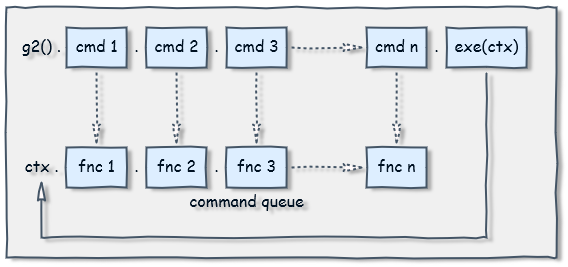
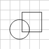

### Introduction ###

_g2_ is a 2D graphics library based on the [command pattern](http://addyosmani.com/resources/essentialjsdesignpatterns/book/#commandpatternjavascript)
principle. It supports the building of a [command queue](https://en.wikipedia.org/wiki/Command_queue)
of graphics instructions for later addressing one or multiple concrete rendering contexts with
an extra benefit of executing the commands in a compact time frame.

_g2_ is intentionally doing exactly one thing - 2D graphics. It has no high level graphical objects,
no user event handling and no animation or interaction capabilities inherently built in.
_g2_ is tiny and completely transparent.

It is aimed at users as scientists and engineers who want an easy way to
occasionally create some prototypal - static or interactive dynamic - 2D web based graphics.
They want a small and high performant library with a simple and intuitive API fully documented
on a single page cheat sheet. In fact _g2_ is currently used for over a year in
engineering education.


### How Queue Processing Works ###

Let's look at a simple example drawing a triangle first.

```javascript
const g = g2();                      // create g2 command queue object.

g.p()                               // begin path
      .m({x:10, y:10})              // first point
      .l({x:90, y:10})              // second point
      .l({x:50, y:90})              // third point
  .z()                              // close path
.drw({ls:"green",lw:3,fs:"orange"}) // stroke and fill
.exe(ctx);                          // finally render graphics addressing 'ctx'.
```


There are only two objects `g2` and `ctx` involved. Both are nearly completely independent
from each other. Only the last code line `exe` establishes a loose connection between them.

With every invokation of a `g2` command method a function pointer
is stored in _g2_'s command queue. Finally with the help of the `g2.exe` method the
function pointers are resolved accordingly and handed
over to a graphics context instance for rendering.



The command queue is implemented as a simple array holding objects containing a
function pointer and an optional arguments array. So the command queue of the example
above, which is build at _compile time_ - i.e. compiling the queue - looks like this:

```javascript
[ {c:g2.prototype.p},
  {c:g2.prototype.m, a:{x:10,y:10}},
  {c:g2.prototype.l, a:{x:90,y:10}},
  {c:g2.prototype.l, a:{x:50,y:90}},
  {c:g2.prototype.z},
  {c:g2.prototype.drw} ]
```
At _rendering time_ the final `exe` command resolves with the knowledge of a concrete renderer
instance type the function pointers to (here HTML canvas context "2d"):

```javascript
[ {c:CanvasRenderingContext2D.prototype.beginPath},
  {c:CanvasRenderingContext2D.prototype.moveTo, a:[10,10]},
  {c:CanvasRenderingContext2D.prototype.lineTo, a:[90,10]},
  {c:CanvasRenderingContext2D.prototype.lineTo, a:[50,90]},
  {c:CanvasRenderingContext2D.prototype.closePath},
  {c:g2.prototype.drw.c2d} ]
```
Applying this array of function pointers to a specific canvas context results in only very
little additional runtime cost
* performing the loop
* resolving the function pointers
* possibly invoking wrapper functions

and moderate additional memory cost (the queue) compared to directly
invoking the canvas context methods, which would read here:

```javascript
ctx.beginPath();
ctx.moveTo(10,10);
ctx.lineTo(90,10);
ctx.lineTo(50,90);
ctx.closePath();
ctx.fill(); ctx.stroke();   // g2.prototype.drw
```

Once you have successfully built a command queue, you can apply it repeatedly
to one or multiple graphics contexts via its `exe`-method.

### Benefits

So _g2_ is not merely a thin wrapper around the canvas context. It is conceptually
renderer agnostic and helps in

* collecting graphics commands in a queue for fast and compact rendering - possibly repeatedly -
at a later time.
* decoupling the graphics commands from the renderer *instance* as well as abstracting away the renderer API.
* separating an applications *model* from its *view*.

Let's elaborate these points a little more.

##### Fast Rendering #####
Graphics intense applications like simulations and games often work with *back buffers* for
improving the visual experience. A back buffer is a temporarily invisible graphics context
used to draw on during a certain time frame. On completion that graphics context is made
visible then. Intermediate flicker effects are minimized by this technique.
A _g2_ object, while at first collecting graphics commands and finally rendering them,
is acting similar to a back buffer.

##### Decoupling #####
A _g2_ object is very loosely coupled with a graphics context. We can decide at the latest
at rendering time, where to send the graphics commands stored in the queue to, or even
send them to multiple different graphics contexts. Rendering the same graphics to a
main window and in parallel to a small zoom-in window would be an example for this.

With the help of an SVG interface library (which is additionally provided), the same
graphics commands could be used to create SVG graphics. This is advantagous in non-graphical
environments like _Node.js_.

##### Separating Model from View #####
Assume a graphics application managing geometric shapes. The applications model will
primarily consist of a container holding objects representing shapes.
Discussing now the problem, how to render the shapes (the *view* in MVC) may lead
to the demand, to strictly separate the model from the view. But then, who knows better
how to draw a shape than the shape itself?

```javascript
class Circle {
    constructor(x,y,r) {this.x=x;this.y=y;this.r=r}
    render(g) {g.cir(this.x,this.y,this.r)}
}
class Rect {
    constructor(x,y,b,h) {this.x=x;this.y=y;this.b=b;this.h=h}
    render(g) {g.rec(this.x,this.y,this.w,this.h)}
}
const model = [new Circle({x:40,y:60,r:20}),new Rect({x:45,y:25,b:40,h:40})],
        g = g2().grid(),
        ctx1 = document.getElementById('c1').getContext('2d'), // view 1
        ctx2 = document.getElementById('c2').getContext('2d'); // view 2

for (let i of model) {  // build command queue of ...
    i.render(g);        // ... model's shapes drawing commands.
}
g.exe(ctx1);            // render to view 1
g.exe(ctx2);            // render to view 2
```


One or multiple lightweight _g2_ objects may act here as neutral mediators
between the model's shapes and the graphics context,
as in: _"Show me how to draw yourself, I will hand this recipe over to a
suitable renderer later!"_

### Feature Details

The function call `g2()` works as a constructor [without](http://javascript.crockford.com/prototypal.html)
[requiring](http://www.2ality.com/2013/07/defending-constructors.html) `new`. The implementation
concept is more _functional_ than _object oriented_. _g2_ inherently has
no knowledge of the size of the graphical viewport - think of an infinite canvas in both dimensions -
until rendering time.

_g2_ basically supports

* method chaining.
* low level path commands with short names adopted from SVG.
  * `p,m,l,q,c,a,z`
* higher level element commands.
  * `rec,cir,lin,arc,ell,ply,img,txt`
* rendering commands.
  * `stroke,fill,drw,clr,grid`
* state stack for style properties and transformations.
  * `beg,end`
* managing the command queue.
  * `cpy,del,dump`
* reuse of other _g2_ objects.
  * `use`
* render the command queue to a graphics context.
  * `exe`
* viewport manipulation methods.
  * `view`
* embedding javascript functions
  * `ins`
* HTML canvas 2D interface.

[See the API Reference](https://github.com/goessner/g2/blob/master/docs/api/g2.core.md).

At current _g2_ is considered feature complete.


As it is very easily extensible, adding custom commands or build custom symbol libraries on top of _g2_
is a nobrainer. Have a look at [g2-mec](./g2.mec.html) as an example.