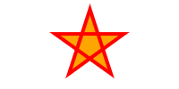

Path commands are low level commands. The names and parameters are adopted from SVG.
See [HTML canvas](https://developer.mozilla.org/de/docs/Web/API/CanvasRenderingContext2D)
and [SVG](https://developer.mozilla.org/en-US/docs/Web/SVG/Tutorial/Paths) documentation for details.

Click [here](https://github.com/goessner/g2/blob/master/docs/api/g2.core.md#g2+p) for the API
Reference.

Command | HTML Canvas | SVG | Result
-------- | ------- | ---------- | --------
`p()`   | `beginPath` | `path` | Start a new path. Previous path commands are discarded.
`m({x,y})` | `moveTo` | `M` | Move to position
`l({x,y})` | `lineTo` | `L`| Create line segment
`q({x1,y1,x,y})` | `quadraticCurveTo` | `Q` |  Create quadratic curve
`c({x1,y1,x2,y2,x,y})` | `bezierCurveTo` | `C` | Create cubic bézier curve
`a({dw,x,y})` | `arcTo` | `A` | Create arc segment
`z()` | `closePath`| `Z` | Close path

Drawing a path works somewhat like a pen plotter. With *pen up* you can move to an arbitrary position.
With *pen down* lines or curves can be drawn. The pen always has a *current position*.


It might be worth to have a closer look at the compact and comfortable arc `a` command. The first
parameter `dw` defines the angular region &phi; of the arc, which can be positive or negative.
In case of &phi; = 0 a straight line is drawn. The amount of &phi; cannot get greater or equal to
2&pi;, which would represent a circle.
You would rarely want to have a full circle inside of a path, but if you really do so, you might
use two consecutive semicircles instead. The last two parameters `x` and `y` are the coordinates
of the target point.

When a path has been completely defined, it can be drawn by a single `stroke`, `fill` or `drw`
command. Avoid invoking multiple drawing commands, f.e. `stroke` and `fill` following a path
definition.
It might work with a HTML canvas 2D renderer, but it won't work with SVG.

Command | HTML Canvas | Result
-------- | ------- | --------
`stroke({d})`   | `stroke` | Stroke the previously defined path.
`fill({d})`   | `fill` |  Fill the previously defined path.
`drw({d})` | `fill` and `stroke` | Fill and stroke the previously defined path in that order.

An optional second argument `d` of `stroke`, `fill` or `drw` can be used to hand over an SVG path data string.
In that case previously defined path commands are ignored.

```javascript
const star = "M100,10L123.5,82.4L61,37.6L138,37.6L76.5,82.4Z";
g2().drw({d:star,lw:4,ls:"red",fs:"orange"})
    .exe(ctx);
```


