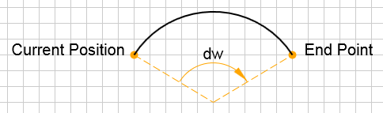

<a name="g2"></a>
## g2([opts]) ⇒ <code>object</code>
Create a queue of 2D graphics commands.

**Kind**: global function
**Returns**: <code>object</code> - g2

| Property | Type | Description |
| --- | --- | --- |
| [opts] | <code>object</code> | Custom options object. It is simply copied into the 'g2' object for later individual use. |

**Example**
```js
// How to use g2()
var ctx = document.getElementById("c").getContext("2d");
g2()                  // Create 'g2' instance.
 .lin({x1:50,y1:50,x2:100,y2:100})  // Append ...
 .lin({x1:100,y1:100,x2:200,y2:50}) // ... commands.
 .exe(ctx);           // Execute commands addressing canvas context.
```

* [g2([opts])](#g2) ⇒ <code>object</code>
  * _instance_
    * [.view({x, y, scl, cartesian})](#g2+view) ⇒ <code>object</code>
    * [.del()](#g2+del) ⇒ <code>object</code>
    * [.p()](#g2+p) ⇒ <code>object</code>
    * [.m({x, y})](#g2+m) ⇒ <code>object</code>
    * [.l({x, y})](#g2+l) ⇒ <code>object</code>
    * [.q({x1, y1, x, y})](#g2+q) ⇒ <code>object</code>
    * [.c({x1, y1, x2, y2, x, y})](#g2+c) ⇒ <code>object</code>
    * [.a({dw, x, y})](#g2+a) ⇒ <code>object</code>
    * [.z()](#g2+z) ⇒ <code>object</code>
    * [.stroke({d})](#g2+stroke) ⇒ <code>object</code>
    * [.fill({d})](#g2+fill) ⇒ <code>object</code>
    * [.drw({d})](#g2+drw) ⇒ <code>object</code>
    * [.txt({str, x, y, w})](#g2+txt) ⇒ <code>object</code>
    * [.img({uri, x, y, b, h, xoff, yoff, dx, dy})](#g2+img) ⇒ <code>object</code>
    * [.lin({x1, y1, x2, y2})](#g2+lin) ⇒ <code>object</code>
    * [.rec({x, y, b, h})](#g2+rec) ⇒ <code>object</code>
    * [.cir({x, y, r})](#g2+cir) ⇒ <code>object</code>
    * [.ell({x, y, rx, ry, w, dw, rot})](#g2+ell)  ⇒ <code>object</code>
    * [.arc({x, y, r, w, dw})](#g2+arc) ⇒ <code>object</code>
    * [.ply({pts, closed, x, y, w})](#g2+ply) ⇒ <code>object</code>
    * [.beg({x, y, w, scl, matrix})](#g2+beg) ⇒ <code>object</code>
    * [.end()](#g2+end) ⇒ <code>object</code>
    * [.clr()](#g2+clr) ⇒ <code>object</code>
    * [.grid({color, size})](#g2+grid) ⇒ <code>object</code>
    * [.use({grp, x, y, w, scl})](#g2+use) ⇒ <code>object</code>
    * [.exe(ctx)](#g2+exe) ⇒ <code>object</code>
  * _static_
    * [.symbol](#g2.symbol) : <code>object</code>

<a name="g2+view"></a>
### g2.view({x, y, scl, cartesian}) ⇒ <code>object</code>
Set the view by placing origin coordinates and scaling factor in device units.
Set the view's cartesian mode flag.<br>

[Example](https://goessner.github.io/g2-svg/test/index.html#view)

**Kind**: instance method of <code>[g2](#g2)</code>
**Returns**: <code>object</code> - g2

| Property | Type | Default | Description |
| --- | --- | --- | --- |
| x | <code>number</code> | <code>0</code> | x-origin in device units. |
| y | <code>number</code> | <code>0</code> | y-origin in device units. |
| scl | <code>number</code> | <code>1</code> | Absolute scaling factor. |
| cartesian | <code>bool</code> | <code>true</code> | Cartesian flag. |


<a name="g2+del"></a>
### g2.del() ⇒ <code>object</code>
Delete all commands. Does not modify view state. (no command)<br>
[Example](https://goessner.github.io/g2-svg/test/index.html#del)

**Kind**: instance method of <code>[g2](#g2)</code>
**Returns**: <code>object</code> - g2
<a name="g2+p"></a>
### g2.p() ⇒ <code>object</code>
Begin new path.<br>
[Example](https://goessner.github.io/g2-svg/test/index.html#path)

**Kind**: instance method of <code>[g2](#g2)</code>
**Returns**: <code>object</code> - g2
<a name="g2+m"></a>
### g2.m({x, y}) ⇒ <code>object</code>
Move to point.<br>
[Example](https://goessner.github.io/g2-svg/test/index.html#path)

**Kind**: instance method of <code>[g2](#g2)</code>
**Returns**: <code>object</code> - g2

| Property | Type | Description |
| --- | --- | --- |
| x | <code>number</code> | Move to x coordinate |
| y | <code>number</code> | Move to y coordinate |

<a name="g2+l"></a>
### g2.l({x, y}) ⇒ <code>object</code>
Create line segment to point.<br>
[Example](https://goessner.github.io/g2-svg/test/index.html#path)

**Kind**: instance method of <code>[g2](#g2)</code>
**Returns**: <code>object</code> - g2

| Property | Type | Description |
| --- | --- | --- |
| x | <code>number</code> | x coordinate of target point. |
| y | <code>number</code> | y coordinate of target point. |

**Example**
```js
g2().p()          // Begin path.
    .m({x:0,y:50})      // Move to point.
    .l({x:300,y:0})     // Line segment to point.
    .l({x:400,y:100})   // ...
    .stroke()     // Stroke path.
    .exe(ctx);    // Render to context.
```
<a name="g2+q"></a>
### g2.q({x1, y1, x, y}) ⇒ <code>object</code>
Create quadratic bezier curve segment to point.<br>
[Example](https://goessner.github.io/g2-svg/test/index.html#path)

**Kind**: instance method of <code>[g2](#g2)</code>
**Returns**: <code>object</code> - g2

| Property | Type | Description |
| --- | --- | --- |
| x1 | <code>number</code> | x coordinate of control point. |
| y1 | <code>number</code> | y coordinate of control point. |
| x | <code>number</code> | x coordinate of target point. |
| y | <code>number</code> | y coordinate of target point. |

**Example**
```js
g2().p()               // Begin path.
    .m({x:0,y:0})            // Move to point.
    .q({x1:200,y1:200,x:400,y:0})  // Quadratic bezier curve segment.
    .stroke()          // Stroke path.
    .exe(ctx);         // Render to context.
```
<a name="g2+c"></a>
### g2.c({x1, y1, x2, y2, x, y}) ⇒ <code>object</code>
Create cubic bezier curve to point.<br>
[Example](https://goessner.github.io/g2-svg/test/index.html#path)

**Kind**: instance method of <code>[g2](#g2)</code>
**Returns**: <code>object</code> - g2

| Property | Type | Description |
| --- | --- | --- |
| x1 | <code>number</code> | x coordinate of first control point. |
| y1 | <code>number</code> | y coordinate of first control point. |
| x2 | <code>number</code> | x coordinate of second control point. |
| y2 | <code>number</code> | y coordinate of second control point. |
| x | <code>number</code> | x coordinate of target point. |
| y | <code>number</code> | y coordinate of target point. |

**Example**
```js
g2().p()                        // Begin path.
    .m({x:0,y:100})                   // Move to point.
    .c({x1:100,y1:200,x2:200,y2:0,x:400,y:100})   // Create cubic bezier curve.
    .stroke()                   // Stroke path.
    .exe(ctx);                  // Render to canvas context.
```
<a name="g2+a"></a>
### g2.a({dw, x, y}) ⇒ <code>object</code>
Draw arc with angular range to target point.<br>


**Kind**: instance method of <code>[g2](#g2)</code>
**Returns**: <code>object</code> - g2

| Property | Type | Description |
| --- | --- | --- |
| dw | <code>number</code> | Angular range in radians. |
| x | <code>number</code> | x coordinate of target point. |
| y | <code>number</code> | y coordinate of target point. |

**Example**
```js
g2().p()            // Begin path.
    .m({x:50,y:50})       // Move to point.
    .a({dw:2,x:300,y:100})   // Create cubic bezier curve.
    .stroke()       // Stroke path.
    .exe(ctx);      // Render to canvas context.
```
<a name="g2+z"></a>
### g2.z() ⇒ <code>object</code>
Close current path by straight line.
[Example](https://goessner.github.io/g2-svg/test/index.html#path)

**Kind**: instance method of <code>[g2](#g2)</code>
**Returns**: <code>object</code> - g2
<a name="g2+stroke"></a>
### g2.stroke({d}) ⇒ <code>object</code>
Stroke the current path or path object.
[Example](https://goessner.github.io/g2-svg/test/index.html#path)

**Kind**: instance method of <code>[g2](#g2)</code>
**Returns**: <code>object</code> - g2

| Property | Type | Description |
| --- | --- | --- |
| d | <code>string</code> | SVG path definition string. Current path is ignored then. |

<a name="g2+fill"></a>
### g2.fill({d}) ⇒ <code>object</code>
Fill the current path or path object.
[Example](https://goessner.github.io/g2-svg/test/index.html#path)

**Kind**: instance method of <code>[g2](#g2)</code>
**Returns**: <code>object</code> - g2

| Property | Type | Description |
| --- | --- | --- |
| d | <code>string</code> | SVG path definition string. Current path is ignored then. |

<a name="g2+drw"></a>
### g2.drw({d}) ⇒ <code>object</code>
Shortcut for stroke and fill the current path or path object.
In case of shadow style, only the path interior creates shadow, not also the path contour.
[Example](https://goessner.github.io/g2-svg/test/index.html#path)

**Kind**: instance method of <code>[g2](#g2)</code>
**Returns**: <code>object</code> - g2

| Property | Type | Description |
| --- | --- | --- |
| d | <code>string</code> | SVG path definition string.  Current path is ignored then. |

<a name="g2+txt"></a>
### g2.txt({str, x, y, w}) ⇒ <code>object</code>
Draw text string at anchor point.
[Example](https://goessner.github.io/g2-svg/test/index.html#txt)

**Kind**: instance method of <code>[g2](#g2)</code>
**Returns**: <code>object</code> - g2

| Property | Type | Default | Description |
| --- | --- | --- | --- |
| str | <code>string</code> |  | Text string. |
| x | <code>number</code> | <code>0</code> | x coordinate of text anchor position. |
| y | <code>number</code> | <code>0</code> | y coordinate of text anchor position. |
| w | <code>number</code> | <code>0</code> | w Rotation angle about anchor point with respect to positive x-axis. |

<a name="g2+img"></a>
### g2.img({uri, x, y, b, h, xoff, yoff, dx, dy}) ⇒ <code>object</code>
Draw image. The command queue will not be executed until all images have been completely loaded.
This also applies to images of reused g2 objects. If an image can not be loaded, it will be replaced by a broken-image symbol.
[Example](https://goessner.github.io/g2-svg/test/index.html#img)

**Kind**: instance method of <code>[g2](#g2)</code>
**Returns**: <code>object</code> - g2

| Property | Type | Default | Description |
| --- | --- | --- | --- |
| uri | <code>string</code> |  | Image uri or data:url. |
| x | <code>number</code> | <code>0</code> | X-coordinate of image (upper left). |
| y | <code>number</code> | <code>0</code> | Y-coordinate of image (upper left). |
| b | <code>number</code> |  | Width. |
| h | <code>number</code> |  | Height. |
| xoff | <code>number</code> |  | X-offset. |
| yoff | <code>number</code> |  | Y-offset. |
| dx | <code>number</code> |  | Region x. |
| dy | <code>number</code> |  | Region y. |

<a name="g2+lin"></a>
### g2.lin({x1, y1, x2, y2}) ⇒ <code>object</code>
Draw line by start point and end point.
[Example](https://goessner.github.io/g2-svg/test/index.html#lin)

**Kind**: instance method of <code>[g2](#g2)</code>
**Returns**: <code>object</code> - g2

| Property | Type | Description |
| --- | --- | --- |
| x1 | <code>number</code> | Start x coordinate. |
| y1 | <code>number</code> | Start y coordinate. |
| x2 | <code>number</code> | End x coordinate. |
| y2 | <code>number</code> | End y coordinate. |

**Example**
```js
g2().lin({x1:10,y1:10,x2:190,y2:10})  // Draw line.
    .exe(ctx);          // Render to context.
```
<a name="g2+rec"></a>
### g2.rec({x, y, b, h}) ⇒ <code>object</code>
Draw rectangle by anchor point and dimensions.
[Example](https://goessner.github.io/g2-svg/test/index.html#rec)

**Kind**: instance method of <code>[g2](#g2)</code>
**Returns**: <code>object</code> - g2

| Property | Type | Description |
| --- | --- | --- |
| x | <code>number</code> | x-value upper left corner. |
| y | <code>number</code> | y-value upper left corner. |
| b | <code>number</code> | Width. |
| h | <code>number</code> | Height. |

**Example**
```js
g2().rec({x:100,y:80,b:40,h:30})  // Draw rectangle.
    .exe(ctx);          // Render to context.
```
<a name="g2+cir"></a>
### g2.cir({x, y, r}) ⇒ <code>object</code>
Draw circle by center and radius.
[Example](https://goessner.github.io/g2-svg/test/index.html#cir)

**Kind**: instance method of <code>[g2](#g2)</code>
**Returns**: <code>object</code> - g2

| Property | Type | Description |
| --- | --- | --- |
| x | <code>number</code> | x-value center. |
| y | <code>number</code> | y-value center. |
| r | <code>number</code> | Radius. |

**Example**
```js
g2().cir({x:100,y:80,r:20})  // Draw circle.
    .exe(ctx);       // Render to context.
```
<a name="g2+ell"></a>
### g2.ell({x, y, rx, ry, w, dw, rot}) ⇒ <code>object</code>
Draw ell by center point, radius in x and y, angle, angular range and rotation.
[Example](https://goessner.github.io/g2-svg/test/index.html#ell)


**Kind**: instance method of <code>[g2](#g2)</code>
**Returns**: <code>object</code> - g2

| Property | Type | Default | Description |
| --- | --- | --- | --- |
| x | <code>number</code> |  | x-value center. |
| y | <code>number</code> |  | y-value center. |
| rx | <code>number</code> |  | Radius in x. |
| ry | <code>number</code> |  | Radius in y. |
| w | <code>number</code> | <code>0</code> | Start angle (in radian). |
| dw | <code>number</code> | <code>2*pi</code> | Angular range in Radians. |
| rot | <code>number</code> | <code>0</code> | Rotation in Radians. |

<a name="g2+arc"></a>
### g2.arc({x, y, r, w, dw}) ⇒ <code>object</code>
Draw arc by center point, radius, start angle and angular range.
[Example](https://goessner.github.io/g2-svg/test/index.html#arc)


**Kind**: instance method of <code>[g2](#g2)</code>
**Returns**: <code>object</code> - g2

| Property | Type | Default | Description |
| --- | --- | --- | --- |
| x | <code>number</code> |  | x-value center. |
| y | <code>number</code> |  | y-value center. |
| r | <code>number</code> |  | Radius. |
| w | <code>number</code> | <code>0</code> | Start angle (in radian). |
| dw | <code>number</code> | <code>2*pi</code> | Angular range in Radians. |

**Example**
```js
g2().arc({x:100,y:100,r:50,w:-Math.PI/4,dw:-Math.PI/2}) // Draw arc.
    .exe(ctx)       // Render to context.
```

<a name="g2+ply"></a>
### g2.ply({pts, closed, x, y, w}) ⇒ <code>object</code>
Draw polygon by points.
Using iterator function for getting points from array by index.
It must return current point object {x,y} or object {closed:true}.
Default iterator expects sequence of x/y-coordinates as a flat array [x,y,...],
array of [[x,y],...] arrays or array of [{x,y},...] objects.
[Example](https://goessner.github.io/g2-svg/test/index.html#ply)

**Kind**: instance method of <code>[g2](#g2)</code>
**Returns**: <code>object</code> - this

| Property | Type | Default | Description |
| --- | --- | --- | --- |
| pts | <code>array</code> |  | Array of points. |
| closed | <code>bool</code> &#124; <code>&#x27;split&#x27;</code> | <code>false</code> | true:closed, false:non-closed, 'split:intermittend lines. |
| x | <code>number</code> | <code>0</code> | Start x coordinate. |
| y | <code>number</code> | <code>0</code> | Start y coordinate. |
| w | <code>number</code> | <code>0</code> | Start angle (in radian). |


**Example**
```js
g2().ply({pts:[100,50,120,60,80,70]}),
    .ply({pts:[150,60],[170,70],[130,80]],closed:true}),
    .ply({pts:{x:160,y:70},{x:180,y:80},{x:140,y:90}]}),
    .exe(ctx);
```

<a name="g2+beg"></a>
### g2.beg({styles}) ⇒ <code>object</code>
Begin subcommands. Current state is saved.
Optionally apply transformation or style properties.
[Example](https://goessner.github.io/g2-svg/test/index.html#beg-end)

**Kind**: instance method of <code>[g2](#g2)</code>
**Returns**: <code>object</code> - g2

| Property | Type | Default | Description |
| --- | --- | --- | --- |
| args | <code>object</code> |  | Arguments object. |
| args.x | <code>number</code> | <code>0</code> | Translation value x. |
| args.y | <code>number</code> | <code>0</code> | Translation value y. |
| args.w | <code>number</code> | <code>0</code> | Rotation angle (in radians). |
| args.scl | <code>number</code> | <code>1</code> | Scale factor. |

<a name="g2+end"></a>
### g2.end() ⇒ <code>object</code>
End subcommands. Previous state is restored.
[Example](https://goessner.github.io/g2-svg/test/index.html#beg-end)

**Kind**: instance method of <code>[g2](#g2)</code>
**Returns**: <code>object</code> - g2
<a name="g2+clr"></a>
### g2.clr() ⇒ <code>object</code>
Clear viewport command.

**Kind**: instance method of <code>[g2](#g2)</code>
**Returns**: <code>object</code> - g2
<a name="g2+grid"></a>
### g2.grid({color, size}) ⇒ <code>object</code>
Draw grid.
[Example](https://goessner.github.io/g2-svg/test/index.html#grid)

**Kind**: instance method of <code>[g2](#g2)</code>
**Returns**: <code>object</code> - g2

| Property | Type | Default | Description |
| --- | --- | --- | --- |
| color | <code>string</code> | <code>&quot;#ccc&quot;</code> | CSS grid color. |
| size | <code>number</code> |  | Grid size. |

<a name="g2+use"></a>
### g2.use([{grp, x, y, w, scl}]) ⇒ <code>object</code>
Reference g2 graphics commands from another g2 object.
With this command you can reuse instances of grouped graphics commands
while applying a similarity transformation and style properties on them.
In fact you might want to build custom graphics libraries on top of that feature.
[Example](https://goessner.github.io/g2-svg/test/index.html#rec)

**Kind**: instance method of <code>[g2](#g2)</code>
**Returns**: <code>object</code> - g2

| Property | Type | Default | Description |
| --- | --- | --- | --- |
| grp | <code>object</code> &#124; <code>string</code> |  | g2 source object or symbol name found in 'g2.symbol' namespace. |
| x | <code>number</code> | <code>0</code> | Translation value x. |
| y | <code>number</code> | <code>0</code> | Translation value y. |
| w | <code>number</code> | <code>0</code> | Rotation angle (in radians). |
| scl | <code>number</code> | <code>1</code> | Scale factor. |

**Example**
```js
g2.symbol.cross = g2().lin({x1:5,y1:5,x2:-5,y2:-5}).lin({x1:5,y1:-5,x2:-5,y2:5});  // Define symbol.
g2().use({grp:"cross",x:100,y:100})  // Draw cross at position 100,100.
    .exe(ctx);                   // Render to context.
```
<a name="style"></a>
### style ⇒ <code>object</code>
Apply new style properties via an style object, which can be appended to g2-commands.

**Kind**: instance method of <code>[g2](#g2)</code>
**Returns**: <code>object</code> - g2

| Property | Type | Default | Description |
| --- | --- | --- | --- |
Property | Type | Default | Comment
------------ |:----------:|--------| -------
`fs` | string | `"transparent"` | Fill color.
`ls` | string | `"black"` | Stroke color.
`lw` | float | `1` | Line width.
`lc` | string | `"butt"` | Line cap [`butt`, `round` and `square`].
`lj` | string | `"miter"` | Line join [`round`, `bevel` and `miter`].
`ml` | float | `10` | Miter limit.
`ld` | array | `[]` | Line dash array.
`sh` | array | `[0,0,0,"transparent"]` | Shadow values array<br> [`x-offset`,`y-offset`,`blur`,`color`].
`thal` | string | `"start"` | Text horizontal alignment [`'start'`,`'end'`,<br>`'left'`,`'right'`,`'center'`].
`tval` | string | `"alphabetic"` | Text vertical alignment [`'top'`,`'hanging'`,<br>`'middle'`,`'alphabetic'`,<br>`'ideographic'`,`'bottom'`].
`font` | string | `"normal 14px serif"` | [Font](https://developer.mozilla.org/en-US/docs/Web/API/CanvasRenderingContext2D/font) [styling](https://html.spec.whatwg.org/multipage/canvas.html#dom-context-2d-font)

**Example**
```js
style1 = { fs:"#58dbfa",           // Set fill style.
             lw:10,                // Set line width.
             ls:"#313942",         // Set line style.
             lj:"round" }          // Set line join.
style2 = { lw:20,                  // Set line width.
             fs:"transparent",     // Set fill style.
             sh:[10,0,10,"black"], // Set shadow x-translation.
             ld:[1,2] };           // Set line dash.
g2().rec({x:10,y:10,b:300,h:100, ...style1})
    .p().m({x:40,y:40}).c({x1:150,y1:150,x2:200,y2:0,x:280,y:50}).drw(style2)
    .exe(ctx);                  // Render to context.
```
<a name="g2+exe"></a>
### g2.exe(ctx) ⇒ <code>object</code>
Execute g2 commands. It does so automatically and recursively with 'use'ed commands.

**Kind**: instance method of <code>[g2](#g2)</code>
**Returns**: <code>object</code> - g2

| Property | Type | Description |
| --- | --- | --- |
| ctx | <code>object</code> | Context. |

<a name="g2.symbol"></a>
### g2.symbol : <code>object</code>
Namespace for symbol objects. A symbol can be used by `use("symbolname")`.

**Kind**: static property of <code>[g2](#g2)</code>
**Example**
```js
g2.symbol.cross = g2().lin({x1:5,y1:5,x2:-5,y2:-5}).lin({x1:5,y1:-5,x2:-5,y2:5});  // Define symbol.
g2().use({grp:"cross",x:100,y:100})  // Draw cross at position 100,100.
    .exe(ctx);                   // Render to context.
```