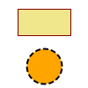

_g2_ allows styling of its commands.
Color values are CSS colors as strings [hex colors, color names, rgb and rgba colors].
You can also reference values from other style properties by their name via string `"@name"` (see example 2 below).

Following style properties are supported:

Property | Type | Default | Comment
------------ |:----------:|--------| -------
`fs` | string | `"transparent"` | Fill color.
`ls` | string | `"black"` | Stroke color.
`lw` | float | `1` | Line width.
`lc` | string | `"butt"` | Line cap [`butt`, `round` and `square`].
`lj` | string | `"miter"` | Line join [`round`, `bevel` and `miter`].
`ml` | float | `10` | Miter limit.
`ld` | array | `[]` | Line dash array.
`sh` | array | `[0,0,0,"transparent"]` | Shadow values array<br> [`x-offset`,`y-offset`,`blur`,`color`].
`thal` | string | `"start"` | Text horizontal alignment [`'start'`,`'end'`,<br>`'left'`,`'right'`,`'center'`].
`tval` | string | `"alphabetic"` | Text vertical alignment [`'top'`,`'hanging'`,<br>`'middle'`,`'alphabetic'`,<br>`'ideographic'`,`'bottom'`].
`font` | string | `"normal 14px serif"` | [Font](https://developer.mozilla.org/en-US/docs/Web/API/CanvasRenderingContext2D/font) [styling](https://html.spec.whatwg.org/multipage/canvas.html#dom-context-2d-font)

### Example 1
```html
<canvas id="c" width="100" height="100"></canvas>
<script src='g2.core.js'></script>
<script>
    const ctx=document.getElementById("c").getContext("2d"),
          style={ls:"red",lw:3,fs:"ddd"};
    g2().rec({x:20,y:10,b:60,h:30,ls:'maroon',fs:'khaki'})
        .cir({x:50,y:75,r:20,lw:2,ld:[6,3],fs:'orange'})
        .exe(ctx)
</script>
```


_g2_ also maintains a graphics state stack similar to the HTML canvas context.
So It manages current transformations and global style properties.

Following commands manipulate the state stack:

Command | Comment
-------- |-------
`beg({styles})` | Save current state and set new transformation and style properties.
`end()` | Restore previous state while discarding current property values.
`use({grp,x,y,w,scl})` | Reuse commands stored in external _g2_ object `g` while applying transformation and style properties from `args` to them.

Transformation properties in `args` can be:

Property | Type | Default | Comment
-------- |:-------:|:----:|-----
`x` | 	float |	`0` | x translation value.
`y` | 	float |	`0` | y translation value.
`w` | 	float |	`0` | Rotation angle in radians. Positive values rotate counterclockwise.
`scl` | 	float |	`1` | scaling factor. Unified scaling only.

### Example 2
```html
<canvas id="c" width="450" height="100"></canvas>
<script src='g2.core.js'></script>
<script>
    const ctx=document.getElementById("c").getContext("2d"),
        fs1={fs:"darkolivegreen",font:"24px serif"},
        fs2={fs:"steelblue",font:"30px serif"},
        fs3={...fs2,fs:"midnightblue"};
    g2().beg({fs:"gainsboro",ls:"firebrick",lw:3,
            thal:"center",tval:"middle"})
            .rec({x:20,y:20,b:80,h:50})
            .txt({str:"one",x:60,y:45,...fs1})
            .beg({y:-10,fs:"darkseagreen",ls:"cadetblue",lw:5})
                .rec({x:120,y:20,b:80,h:50})
                .txt({str:"two",x:160,y:45,...fs2})
                .beg({ls:"@fs",fs:"cadetblue"})
                    .rec({x:220,y:20,b:80,h:50})
                    .txt({str:"three",x:260,y:45,...fs3})
                .end()
            .end()
            .rec({x:320,y:20,b:80,h:50})
            .txt({str:"four",x:360,y:45,...fs1})
        .end()
        .exe(ctx);
</script>
```


### Example Yinyang
```html
<canvas id="c" width="100" height="100"></canvas>
<script src='g2.core.js'></script>
<script>
    const ctx=document.getElementById("c").getContext("2d"),
          pi = Math.PI, dark = "#444", light = "#eee";
    g2().beg({x:50,y:50,scl:2,fs:light,ls:dark,lw:2})
            .cir({x:0,y:0,r:20})
            .beg({fs:"@ls"})
                .p()
                .m({x:0,y:-20})
                .a({dw:pi,x:0,y:0})
                .a({dw:-pi,x:0,y:20})
                .a({dw:-pi,x:0,y:-20})
                .z()
                .fill()
                .cir({x:0,y:-10,r:3})
                .cir({x:0,y:10,r:3,ls:light,fs:"@ls"})
            .end()
        .end()
        .exe(ctx);
</script>
```


### Fonts

Fonts are manipulated throught the `font` property.
_g2_ utilizes css styling methods.

Read more about font styling
[here](https://developer.mozilla.org/en-US/docs/Web/API/CanvasRenderingContext2D/font)
and
[here](https://html.spec.whatwg.org/multipage/canvas.html#dom-context-2d-font):
```
For example, after the following statement:

    context.font = 'italic 400 12px/2 Unknown Font, sans-serif';

...the expression context.font would evaluate to the string "italic 12px "Unknown Font", sans-serif".
The "400" font-weight doesn't appear because that is the default value.
The line-height doesn't appear because it is forced to "normal", the default value.
```
The `font` property accepts strings in the presented format.
