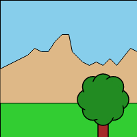

_g2_ has no limits. Think of a 2D coordinate system with infinite range in _x_- and _y_-direction.
This is our _user coordinate system_ with coordinate values we have in mind.
Then we finally need to coincide this user coordinate system with some renderers coordinate
system - the _device coordinate system_.
That device viewport is usually rectangular and limited of course. Its coordinate origin lies in the viewports
upper left corner, is lefthanded with x-axis to the right and y-axis down and its
positive rotation is clockwise, as usual in computer graphics.


So we want to displace the origin of our user coordinate system - named _View_ - relative
to the renders rigid one. We also want to scale the user units, wich initially also coincide with the device units - think of pixels here.

The `view` method manipulates the current view state relevant for the next rendering process via the `exe()` command.

Method | Comment
-------- |-------
`view({scl,x,y,cartesian})` | Implicitely set the _View_ transformation uniformly by setting absolute scaling factor `scl` and origin at `x`,`y` in device units each. The `cartesian` property is boolean and switches the cartesian coordinate system mode on or off. The origin is placed initially in the viewport's lower left corner, x-axis right and y-axis up and positive rotation counterclockwise.

This output is generated by the follwing code addressing different renderer contexts.

```javascript
world = g2().view(worldview)
            .rec({x:0,y:0,b:200,h:200,fs:"skyblue"})
            .ply({pts:[0,100,40,...],fs:"burlywood"})
            .rec({x:0,y:0,b:200,y:150,fs:"limegreen"}),

tree = g2().view(treeview)
           .rec({x:-5,y:0,b:10,h:40,fs:"brown"})
           .beg({fs:"forestgreen"})
               .cir({x:15,y:-20,r:10})
               ...
               .cir({x:0,y:-20,r:20,ls:"transparent"})
           .end();

g2().use({grp:world,x:0,y:0})
    .use({grp:tree,x:100,y:150})
    .exe(ctx1)

g2().use({grp:world,x:0,y:0})
    .view({x:0,y:-50,scl:1.5})
    .use({grp:tree,x:100,y:150})
    .exe(ctx2)

g2().view({x:0,y:-50,scl:1.5})
    .use({grp:world,x:0,y:0})
    .use({grp:tree,x:100,y:150})
    .exe(ctx3)
```

  


Remark that `view` could be omitted here and the same picture could be generated just with `use`. This is for demonstation purpose only.

Please note that _g2_ does not support all _affine_ view transformations. It allows _similarity
transformations_ as _translation_, uniform _scaling_ as well as _reflection_ with respect to x-axis.
It does not support _nonuniform scaling_, _rotation_ or _shearing_ of its _View_.
