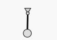

Even though _g2_ is no animation library, it is quite easy to animate graphics. We focus here on canvas based graphics
as SVG has powerful inherent animation capabilities.

For animation purposes _g2_ offers two simple but important commands:

Method/Command | Comment
-------- |-------
`del()` | Delete the complete command queue. It is itself not a command but a method which is invoked immediately. Calling `del()` makes sense at the beginning of a command queue or after any `exe` command.
`clr({b,h})` | Clear the viewport (completely or just within range of {b,h}. Does so during each rendering process, as it is a command.

Now to start with animation, we should be familiar with browsers [window.requestAnimationframe](https://developer.mozilla.org/en-US/docs/Web/API/window/requestAnimationFrame)
method, which gets a callback function as parameter.

The most primitive way is to always create a new command queue in the callback function we have to provide.

### Example
```javascript
    const g = g2(), x0 = 50, y0 = 50, r = 40, dphi = 0.02;
    let phi = 0;
    function render() {
        const x=x0+r*Math.sin(phi),y=y0+r*Math.cos(phi);
        // draw pendulum ...
        g.del()                                 // delete all commands in the queue ...
        .clr()                                  // clear the renderers viewport ...
        .ply({pts:[44,40,56,40,x0,y0],closed:true,fs:"#ddd"})
        .lin({x1:x0,y1:y0,x2:x,y2:y,lw:3})      // pendulum begins ..
        .cir({x:x0,y:y0,r:3,fs:"#ddd"})         // .. and ends here.
        .cir({x:x,y:y,r:8,fs:"#ddd"})
        .exe(ctx);
        phi += dphi;                            // increment angle ...
        requestAnimationFrame(render);          // requedst browser to call 'render' again ...
    }
    render();                                   // initial render call.
```


The most important thing with animation is to always delete the command queue by `del`, as otherwise the queue array is
ever growing - which is often not visible due to the `clr` command, but the execution gets jerky in the long run.

Not using `clr` is not as criticle, because previous positions are permanently visible. Sometimes this is exactly
what we want.

Let's improve the previous example. We can identify _static_ geometry - which does not move - and _dynamic_ geometry.
So it makes sense, to only redefine the moving part of the drawing.

### Example - Enhanced
```javascript
const pendulum = g2(), x0 = 50, y0 = 50, r = 40, dphi = 0.02;
let phi = 0;

world = g2().clr()                              // clear and then define static world
            .ply({pts:[44,40,56,40,x0,y0],closed:true,fs:"#ddd"})
            .use({grp:pendulum})                // reference pendulum here...
            .cir({x:x0,y:y0,r:3})
function render() {
    const x=x0+r*Math.sin(phi),y=y0+r*Math.cos(phi);

    pendulum.del()                              // rebuild pendulum...
            .lin({x1:x0,y1:y0,x2:x,y2:y,lw:3})  // pendulum begins ..
            .cir({x:x,y:y,r:8,fs:"#ddd"})
    world.exe(ctx);
    phi += dphi;
    requestAnimationFrame(render);
}
render();
```
Static geometry is collected in a _g2_ object which is defined only once initially while only referencing
the moving parts. Dynamic geometry is then defined in one or more other _g2_ objects and continuously rebuild
in the render function. During animation the complete graphics command queue is repeatedly rendered via `exe`
command. Please remember that drawing occurs completely at rendering time controlled by `exe` in a very compact
time. So animation is very smooth, as _g2_'s command queue works like a back buffer.

See [_g2_ clock](https://github.com/goessner/g2/blob/master/sample/wiki-samples/clock.html) as another example using that technique.

In fact the example above could be improved even more as the pendulum - as a rigid body - could be defined only once
and then transformed via `use` to its current position each time step. One can also think about replacement of that
`use` command with every frame in the command queue or even only replace its transform argument. But _g2_ neither
supports micro-manipulation of the command queue entries nor intends to do so.

In a possible next optimization step we could render the static parts to an extra layer - another renderer context -
which is drawn only once then.

### Example - Timed Animation

Using `window.requestAnimationFrame` makes timed animation particularly easy. It passes a timestamp with every call
to the callback function.

```javascript
const ctx = document.getElementById("c").getContext("2d"),
        pendulum = g2(), x0 = 50, y0 = 50, r = 40, omega = 1.5,
        world = g2().clr()
                    .ply({pts:[44,40,56,40,x0,y0],closed:true,fs:"#ddd"})
                    .use({grp:pendulum})
                    .cir({x:x0,y:y0,r:3});
function render(time) {
    const t0 = render.first || (render.first = time),   // memoize time at first call ...
            t = (time - t0)/1000,
            phi = Math.PI/3*Math.sin(omega*t),          // oscillating equation...
            x=x0+r*Math.sin(phi),y=y0+r*Math.cos(phi);

    pendulum.del()
            .lin({x1:x0,y1:y0,x2:x,y2:y,lw:3})
            .cir({x:x,y:y,r:8,fs:"#ddd"})
    world.exe(ctx);
    requestAnimationFrame(render);
}
render();
```

