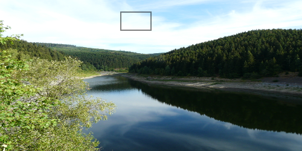

Element commands are higher level commands. The following elements are supported by _g2_.

Element | Canvas | SVG | Result
-------- |:-------:|:----------:| --------
`lin({x1,y1,x2,y2})`   | - | `line` | Line element by start and end point.
`rec({x,y,b,h})` | `rect` | `rect` | Rectangle element by anchor point, width and height.
`cir({x,y,r})` | - | `circle` | Circle element by center point and radius.
`arc({x,y,r,w,dw})` | - | - |  Arc element by center point, radius, start angle [radians] and angular range [radians].
`ply({pts,closed,x,y,w})` | - | `polygon` | Polyline element by points array, closed mode [boolean] and iterator function.
`txt({str,x,y,w})` | `fillText` | `text` | Text element by string, anchor point, angle and style object.
`img({uri,x,y,b,h,`<br>`    xoff,yoff,dx,dy})` | `drawImage`| `image` | Image element by URI, anchor point, width, height, offset and range.

#### `ply` Element
[See the API Reference](https://github.com/goessner/g2/blob/master/docs/api/g2.core.md#g2+ply)

The `ply` command expects an object with a `pts` property.
This property can have different formats, for each of which there must be provided an individual
array iterator. _g2_ implements three standard iterators:

Property Format | comment
-------- | -------
`{pts:[x1,y1,x2,y2,...,xn,yn]}` | Flat array of `x` and `y` values [default].
`{pts:[[x1,y1],[x2,y2],...,[xn,yn]]}` | Array of arrays of `x` and `y` values.
`{pts:[{x:x1,y:y1},{x:x2,y:y2},...,{x:xn,y:yn}]}` | Array of objects with `x` and `y` members.

Another property of `ply` is `closed` which can have boolean values `true` and `false`.

```javascript
    const style={ls:"red",lw:3,fs:"ddd"};
    g2().ply({pts:[10,10,40,70,60,30,90,80],...style})
        .ply({pts:[[110,10],[140,70],[160,30],[190,80]],closed:true,...style})
        .exe(ctx);
```


`ply` is also a convenient method for traces or paths to be drawn.
Just fill an array in the appropriate format and render it.
```js
const arr = []; // array to be filled
let i = 0;      // iterator
let forward = true;
(function render() {
    i+=0.5;
    // Fill array with values when going forward
    forward ? arr.push({x: Math.cos(Math.PI * i / 60 ) * 40, y: Math.sin(Math.PI * i / 20) * 40}) 
    // And remove values otherwise
            : arr.shift();
    // Toggle direction when path closes
    if (arr.length === 240 || arr.length === 0) {
        forward = !forward;
    }
    g2().del()
        .clr()
        .view({x: 75,y: 50})
        .ply({pts:arr,ls:'blue',lw:3}) // render this array.
        .exe(ctx);
    requestAnimationFrame(render);
})();
```


### Text
[See the API Reference](https://github.com/goessner/g2/blob/master/docs/api/g2.core.md#g2+txt)

Text is supported by the `txt` command. One property of `txt`, `str` specifies the text string. The next two
`x` and `y` determine the anchor position of the text element. `w` describes the rotation angle and
the last `style` argument is an object containing individual text and font style information. That
style properties have priority over previously defined properties, but do not overwrite them.

```javascript
const style={ls:"red",lw:3,fs:"ddd"};
      g2().txt({str:"Hello world",x:30,y:50,w:-0.15,font:"32px cursive",fs:'rebeccapurple'})
          .txt({str:"default style",x:210,y:40})
          .exe(ctx);
```


### Images
[See the API Reference](https://github.com/goessner/g2/blob/master/docs/api/g2.core.md#g2+img)

Images can be inserted by the `img` command. One property, `uri`, is the URI of the image, which
can also be a  _data:url_. `img` has a lot of properties for the desired representation of the
image. `x,y` define the position of the upper left corner, `b,h` the breath and height,
`xoff, yoff` create an offset, `sb,sh` a region for the image and `sx, sy` may crop the image.
It can be scaled with `scl`.

Images are rendered asynchronously. The command queue stops when the image is to be drawn and continues after that.
If more than one command queue is issued on one context, it may happen that the order of drawings is inconsistent.

```html
<canvas id="c" height="250px" width="500px"></canvas>
<script src="../../g2/src/g2.core.js"></script>
<script>
    const ctx = document.getElementById("c").getContext("2d");
    const photo = "../img/photo.jpg";

    g2().img({uri:photo,b:500,h:250})
        .rec({x:200,y:20,b:50,h:30})
        .exe(ctx);
</script>
```


If an image can not be loaded, it will be replaced by a broken-image symbol:


