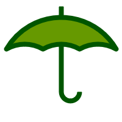
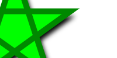

Let's start with a quick tour of g2.core's features and look at it by short examples.

  * [Paths](#paths)
  * [Elements](#elements)
  * [State and Style](#style)
  * [View](#view)
  * [Grouping and Reuse](#reuse)
  * [Insert](#insert)
  * [Animation](#animation)
  * [Interactivity](#interactivity)
  * [Extensions](#extensions)

For a more thorough explanation please make use of the sidebar.

<a name="paths"></a>
#### Paths
Path definitions are similar to canvas notation while using short SVG syntax.
Note the simplicity of arc declarations.
```html
<canvas id="c" width="200" height="200"></canvas>
<script src="g2.core.js"></script>
<script>
    const ctx = document.getElementById("c").getContext("2d"),
          pi = Math.PI,
          style = {fs:"#690",ls:"#050",lw:8,lj:"round"};
    let umbrella = g2();
    umbrella.p()                            // make stick
                .m({x:100,y:10})            // top of shaft
                .l({x:100,y:150})           // shaft
                .a({dw:-pi,x:130,y:150})    // handle
            .stroke(style)                  // style stick.
            .p()                            // make covering
                .m({x:10,y:80})             // leftmost point
                .a({dw:pi/3,x:70,y:80})     // three ...
                .a({dw:pi/3,x:130,y:80})    // ... small ...
                .a({dw:pi/3,x:190,y:80})    // ... arcs
                .a({dw:-2*pi/3,x:10,y:80})  // big arc back to leftmost point.
            .z()                            // close gap
            .drw(style)                     // style covering.
            .exe(ctx);                      // draw to canvas
</script>
```


Read more about how paths are used [here](./Paths.html).

<a name="elements"></a>
#### Elements
Two consecutive commands `cir-txt` are building the command queue. Then these commands are executed
addressing a particular canvas context.
```html
<canvas id="c" width="100" height="100"></canvas>
<script src="g2.core.js"></script>
<script>
    ctx = document.getElementById("c").getContext("2d");
    g2().cir({x:50,y:50,r:40,fs:"moccasin",ls:"maroon",lw:3})
        .txt({str:"Hello",x:50,y:55,w:0,thal:"center",font:"24px serif",ls:"maroon"})
        .exe(ctx);
</script>
```


Read more about how elements are used [here](./Elements.html).

<a name="view"></a>

#### View transformation
Once built, a graphics command queue can be used to address multiple renderers.
Renderer instances can also be placed on top of each other.
So _g2_ supports a cheap layering technique. Please note the ability to use SVG path strings.
```html
<canvas id="c1" width="200" height="100"></canvas>
<canvas id="c2" width="200" height="100"></canvas>
<script src='./g2.core.js'></script>
<script>
   const star = "M100,10L123.5,82.4L61,37.6L138,37.6L76.5,82.4Z",
         ctx1 = document.getElementById("c1").getContext("2d"),
         ctx2 = document.getElementById("c2").getContext("2d"),
         vw = {x:0,y:0,scl:1},
         g = g2().view(vw).drw({d:star,lw:4,ls:"#080",fs:"#0f0",sh:[8,8,8,"black"]});

    g.exe(ctx1);
    vw.x = -225; vw.y = -50; vw.scl = 2.5;
    g.exe(ctx2);
</script>

```


Read more about how the view is transformed [here](./View.html).

<a name="reuse"></a>

#### Grouping and Reuse
It is easy to reuse predefined geometry by defining multiple g2 objects. Styles can be inherited
by g2 children from their parents.
```html
<canvas id="c" width="400" height="120"></canvas>
<script src="g2.core.js"></script>
<script>
    const ctx = document.getElementById("c").getContext("2d"),
        pi = Math.PI,
        wheel = g2().cir({x:0,y:0,r:15})
                    .cir({x:0,y:0,r:3,fs:"@ls"}),
        car   = g2().p()
                        .m({x:-75,y:20})
                        .a({dw:-5*pi/6,x:35,y:50})
                        .a({dw:-pi/2,x:75,y:20})
                        .z()
                    .drw()
                    .use({grp:wheel,x:-40,y:20,fs:"snow",lw:3})
                    .use({grp:wheel,x: 40,y:20,fs:"#9c9",lw:3});
    g2().view({cartesian:true})
        .use({grp:car,x:100,y:25,ls:"#900",fs:"#f4a460",lw:4})
        .use({grp:car,x:300,y:25,scl:0.75,ls:"green",fs:"orange",lw:4})
        .exe(ctx);
</script>
```


Read more about how reuse is used [here](./Reuse.html).

<a name="insert"></a>

#### Insert

Read more about how ins is used [here](./Insert.html).

<a name="animation"></a>

#### Animation

Read more about how animations are used [here](./Animation.html).

<a name="interactivity"></a>

#### Interactivity

Read more about interactive rendering [here](./Interactivity.html).

<a name="extensions"></a>

#### Extensions

Read more about g2's extensions here:
* [g2.ext](./g2.ext.html)
* [g2.mec](./g2.mec.html)
* [g2.chart](./g2.chart.html)


<!-- TODO: Put this in animation or interactivity. -->
### Arrow notation

`g2` commands don't have to be declared with static parameters.
They can be changed at 'run time' and display changes in the next rendering via `exe()`.

```html
<canvas id="c"></canvas>
<script src="./g2.core.js"></script>
<script>
  const ctx = document.getElementById("c").getContext("2d");
  let radius = 10, color = "rgb(0,255,0)", x = 10,
  g = g2().cir({x:()=>x, y:75,r:()=>radius,fs:()=>color});
  g.exe(ctx);
  while(x<=250) {
    x+=radius;
    radius+=1;
    color="rgb("+x+","+(255-x)+",0)";
    g.exe(ctx);
  }
</script>
```


_Note that the command queue is not altered after its initial definition._