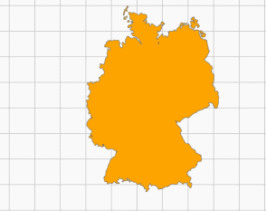
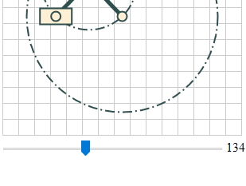
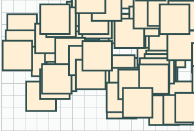

_g2_ has no interactive capabilities built in. But if it runs in browser environment the browser's interactive features can be used.
There are a lot of frameworks and libraries making web developer's life more easier regarding UI. For the sake of
simplicity we confine ourselfs to pure HTML with the following examples.

Please see below how `window.requestAnimationFrame` can be used with interactivity for easy and efficient rendering.
Most of the time it should do nothing.


### View Manipulation

For letting the user modify _g2_'s view HTML's pointer events are used as well as the `view` method
already presented in [View](./View).

```javascript
// Pan the view when user moves the pointer with any button pressed.
function onmove(e) {
    if (e.buttons !== undefined ? e.buttons : (e.which || e.button)) {
        const dx = e.movementX || e.mozMovementX || e.webkitMovementX || 0,
              dy = e.movementY || e.mozMovementY || e.webkitMovementY || 0;
              vw.x+=dx,vw.y+=dy;                        // g2.view uses device coordinates
    dirty = true;
    }
}
// Zoom the view when user uses the mouse wheel.
function onwheel(e) {
    const delta = Math.max(-1,Math.min(1,e.deltaY||e.wheelDelta));
            vw.scl *= delta > 0?9/10:10/9;              // g2.view again uses device coordinates
            vw.x = e.clientX - Math.floor(viewport.left),
            vw.y = e.clientY - Math.floor(viewport.top),
    dirty = true;
}
// Render the view on user action ..
function render() {
    dirty = dirty && !g.exe(ctx);
    requestAnimationFrame(render);
}
let dirty = true;                                       // render only on user action ...
const ctx = document.getElementById("c").getContext("2d"),
        viewport = ctx.canvas.getBoundingClientRect(),  // viewport size ..
        vw = {x:0,y:0,scl:1},
        map = "M 163 1 C 162.6 1.6 162.3 ...",          // map as SVG path data string ..
g = g2().view(vw)                                       // use vw to change view on the run
        .clr().grid()
        .drw({d:map, ls:"#666", fs:"orange", lw:2, lc:"round", lj:"round"});

ctx.canvas.addEventListener("mousemove", onmove, false);// listen to move event ..
ctx.canvas.addEventListener("wheel", onwheel, false);   // listen to wheel event ..
render();
```



Updating the command queue can occur directly in event handlers and drawing via `exe` is preferrably
done in the `render` function.

There is also another zoom example using an [extra zoom window](https://goessner.github.io/g2/examples/screw.html)


### HTML Input Element

HTML input elements can be used to modify graphics related data.

```html
<canvas id="c" width="300" height="200"></canvas>
<br>
<input id="range" type="range" style="min-width:275px;vertical-align:middle;margin:0;padding:0"
       min="0" max="360" value="0" step="1" />
<output id="output" for="range" style="text-align:right;">0</output>
<script src='g2.core.js'></script>
<script>
    function position(phi) {
        const sp = Math.sin(phi), cp = Math.cos(phi),
              xA = a*cp, yA = a*sp,             // calculate current position data ...
              xB = 2*a*cp, yB = 0,
              xC = 0, yC = 2*a*sp;

        mec.del()                               // ... and build new mechanism geometry.
           .ell({x:xA,y:yA,rx:a,ry:this.rx,rot:-phi,lw:2,ld:[12,4,2,4]})
           .ply({pts:[0,0,xA,yA,xB,yB,xC,yC],lw:5})
           .beg({...el})
           .cir({x:xA,y:yA,r:6})
           .rec({x:xB-20,y:yB-10,b:40,h:20})
           .cir({x:xB,y:yB,r:6})
           .rec({x:xC-10,y:yC-20,b:20,h:40})
           .cir({x:xC,y:yC,r:6})
           .end();
    }
    function setPhi(e) {                        // set user controlled angle.
        if (dirty = (range.value !== output.value)) {
            phi = (output.value = range.value)/180*Math.PI;
        }
        return true;
    }
    function render() {
        if (dirty) {
            position(phi);
            world.exe(ctx);
            dirty = false;
        }
        requestAnimationFrame(render);
    }
    let dirty = true,
        phi = 0, xA, yA, xB, yB;
    const ctx = document.getElementById("c").getContext("2d"),
          range = document.getElementById("range"),
          output = document.getElementById("output"),
          el = {fs:"papayawhip",lw:2},
          xA0 = 150, yA0 = 150, a = 60, b = 80, e = 0;
          mec = g2(),                           // dynamic mechanism.
          world = g2().clr().cartesian().grid() // static world.
                      .cir({x:xA0, y:yA0, r:2*a, ls:"darkslategray", lw:2, ld:[12,4,2,4]})
                      .use({grp:mec, x:xA0, y:yA0})
                      .cir({x:xA0, y:yA0, r:6,...el});
    range.addEventListener("input",setPhi,false);
    render();
</script>
```


This example again uses an advantageous separation of static and dynamic geometry (s. [Animation](./Animation)).


### Using Layers

In the case of having much rendering work to do with each user input one might consider to distribute graphics to a static
background layer and an interactive foreground layer using two or more stacked canvases. So when interaction occurs
only the interactive layer must be updated and thus the overall rendering effort may be reduced significantly.

Here is a clearly written in depth article about [HTML canvas layering](http://www.ibm.com/developerworks/library/wa-canvashtml5layering/).


```html
<div style="position:relative; width:641px; height:481px;">
    <canvas id="bg" width="641" height="481" style="position:absolute;"></canvas>
    <canvas id="fg" width="641" height="481" style="position:absolute;"></canvas>
</div>
<p>Select square by pointer and drag it.</p>
<script src='g2.core.js'></script>
<script>
    function onbuttondown(e) {                                      // select square at pointer location.
        const x = e.clientX - Math.floor(viewport.left),
              y = e.clientY - Math.floor(viewport.top);

        for (let i=rects.length-1; i>=0; i--) {                     // test all squares.
            if (x - rects[i].x >= 0 && x - rects[i].x <= sz &&      // hit occured?
                y - rects[i].y >= 0 && y - rects[i].y <= sz) {
                bgDirty = fgDirty = true;                           // mark layers by dirty flags.
                selIdx = i;                                         // memoize selected square.
                ctxfg.canvas.addEventListener('mousemove',onmove,false);    // ready to drag.
                break;
            }
        }
    }
    function onbuttonup(e) {                                        // deselect square
        if (selIdx != -1) {                                         // is one selected
            bgDirty = fgDirty = true;                               // mark layers by dirty flags.
            ctxfg.canvas.removeEventListener('mousemove',onmove,false);     // finish dragging.
            selIdx = -1;                                                    // nothing selected.
        }
    }
    function onmove(e) {                                            // drag square ...
        const rec = rects[selIdx];
        rec.x += (e.movementX || e.mozMovementX || e.webkitMovementX || 0); // by relative ...
        rec.y += (e.movementY || e.mozMovementY || e.webkitMovementY || 0); // displacement..
        fgDirty = true;               // only mark interactive foreground layer by dirty flag.
    }
    function render() {                                             // render loop.
        if (bgDirty) {                                              // render background ...
            bg.del().clr().grid();
            for (let i=0; i<rects.length-1; i++) {
                if (i !== selIdx) {
                    bg.rec({x:rects[i].x,y:rects[i].y,b:sz,h:sz,
                            ls:"darkslategray",lw:3,fs:"papayawhip"});
                }
            }
            bg.exe(ctxbg);
            bgDirty = false;
        }
        if (fgDirty) {                                              // render foreground ...
            fg.del().clr();
            if (selIdx != -1) {
                fg.rec({x:rects[selIdx].x,y:rects[selIdx].y,b:sz,h:sz,
                        lw:3,sh:[0,0,10,"black"]})
                  .rec({x:rects[selIdx].x,y:rects[selIdx].y,b:sz,h:sz,
                        lw:3,ls:"darkslategray",fs:"orange"});
            }
            fg.exe(ctxfg);
            fgDirty = false;
        }
        requestAnimationFrame(render);
    }

    let bgDirty = true, fgDirty = true,
        selIdx = -1;
    const ctxbg = document.getElementById("bg").getContext("2d"),
          ctxfg = document.getElementById("fg").getContext("2d"),
          viewport = ctxbg.canvas.getBoundingClientRect(),
          bg = g2(),                                                // Background layer command queue.
          fg = g2(),                                                // Foreground layer command queue for dragging.
          rects = [], sz = 50;

    for (let i = 0; i < 300; i++) {
        rects[i] = { x: Math.random()*(viewport.width-sz),
                     y: Math.random()*(viewport.height-sz) };
    }

    ctxfg.canvas.addEventListener('mousedown', onbuttondown, false);
    ctxfg.canvas.addEventListener('mouseup',   onbuttonup, false);

    render();                                                       // initial call to render loop.
</script>
```

