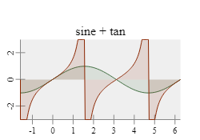
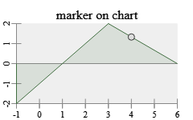

# g2.chart

`g2.chart` is an important brick for [`g2.js`](https://github.com/goessner/g2) being an engineers and scientists graphics tool.
`g2.chart` as a [`g2`](https://github.com/goessner/g2) addon generates x/y-line charts only, but it does that very well. 

### Example: first chart


```html
<canvas id="c" width="250" height="175"></canvas>
<script src="https://gitcdn.xyz/repo/goessner/g2/master/src/g2.js"></script>
<script>
    g2().view({cartesian:true})
        .chart({x:35,y:35,b:200,h:120,
            funcs:[{data:[-2,6,0,-2,2,1,4,1,6,5],fill:true,dots:true}],
            xaxis:{},
            yaxis:{},
        })
        .exe(document.getElementById("c").getContext("2d"));
  </script>
```
## Chart usage
`g2.chart` introduces a new `chart` command, which expects a single javascript object
specifying the chart properties. In order to use it properly you need to set `g2`'s 
cartesian flag. You want to set the chart dimensions by specifying the lower left corner `x` and `y` 
as well as width `b` and height `h` of the rectangular chart area. 
Please note, that chart title, axis ticks, labels and titles are not included in that dimensions.


## Chart functions, range and style
Line charts display functional relations. These relations can be numerically represented via datasets or 
algebraically via functions. `g2.chart` offers both representations. A single chart can contain multiple 
functions and even mix numerical and algebraic forms.

The chart x-value range is extracted from available datasets or must be explicitly specified. Its 
y-value range can be derived from both datasets and algebraic functions or - again - be explicitly 
set. 

### Example: multiple functions


```js
g2().view({cartesian:true})
    .chart({x:25,y:25,b:200,h:100,
            title:{text:"sine + tan"},
            xmin:-Math.PI/2,xmax:2*Math.PI,
            ymin:-3,ymax:3,
            funcs:[
              {fn:Math.sin,dx:Math.PI/30,fill:true},
              {fn:Math.tan,dx:Math.PI/90,fill:true}
            ]})
    .exe(ctx);
```

In this example the x-value range is explicitely set by `xmin` and `xmax`. It is valid then for all functions.
The y-value range is also explicitely set by `ymin` and `ymax`. That is done here only, because 
the `tan`-function has singularities at odd multiples of `pi/2`. So its chart is  simply clipped to the 
desired range of `[-3,3]`.

Please note that we didn't specify a color for displaying the functions in the last example. `g2.chart` provides a small set of 
default colors for sequentially assigning them to functions without explicite color definitions. If the 
`fill` property is set to `true`, the function chart is filled with respect to the `zero` x-axis using 
its semi-transparent function color.

### Example: Axis properties


```js
g2().view({cartesian:true})
    .chart({ x:35,y:35,b:200,h:100,
             title:{ text:"sin(φ)"},
                     xmin:-Math.PI/2,xmax:2*Math.PI,
                     funcs:[
                       {fn:Math.sin,dx:Math.PI/30,fill:true}
                     ],
                     xaxis: {
                       title:"φ",
                       grid:true
                     },
                     yaxis: {
                       title:"sin(φ)",
                       origin:true
                     }
                   })
    .exe(ctx);
```

## Chart API

After a chart object is created, we might want to interact with it then. So we would like to request 
canvas coordinates for certain chart area coordinates. There is a small API for supporting tasks like this.

| Method | Arguments | Returns | Description |
| --- | --- | --- | --- |
| `valOf(pix)` | `pix` canvas point | `object` | Point value in chart coordinates from point in canvas coordinates. |
| `pixOf(usr)` | `usr` chart point | `object` | Point value in canvas coordinates from point in chart coordinates. |
| `trimPixOf(usr)` | `usr` chart point | `object` | Point value in canvas coordinates from point in chart coordinates trimmed to chart area region limits. |
| `yOf(x)` | `x` chart x-value | `float` | y-value in chart coordinates. |
| `drawMarkersAt(g,x)` | `g` `g2` instance `x` chart x-value | `object` | Draw marker points in canvas coordinates to `g2` instance `g` according to x-value for all functions in chart. |

It is possible to place markers on chart functions after they are generated. For this we use a `g2` feature to transfer
its prototype on objects which are given as parameters to `g2` commands.
### Example: chart marker


```js
    const ctx = document.getElementById("c").getContext("2d");
    const chrt = { x:20,y:20,b:200,h:100,
            funcs:[{data:[-1,-2,3,2,6,0],fill:true}],
            title:{text:"marker on chart"},
            xaxis:{},
            yaxis:{origin:true}
            };
    g = g2().view({cartesian:true});
    g.chart(chrt)
     .exe(ctx);
    g.nod({...chrt.pntOf({x:4,y:1.33})}).exe(ctx);
```
Those markers can be set interactively then.

### Example: interactive chart


```javascript
  const ctx = document.getElementById("c").getContext("2d"),
      range = document.getElementById("range"),
      output = document.getElementById("output"),
      chrt = {
          x:100,y:50,b:200,h:150,
          xmin:-Math.PI/2,xmax:2*Math.PI,
          ymin:-0.75,ymax:0.75,
          funcs:[
              {fn:Math.sin,dx:Math.PI/30,fill:true},
              {fn:Math.cos,dx:Math.PI/30,fill:true},
          ],
          title:"sine + cosine (clipped)",
          xaxis:{title:"phi"},
          yaxis:{title:"sin(phi)",origin:true}
      };
  let phi = -Math.PI/2, mrk1,mrk2;
  function render() {
      g2().clr()
          .view({cartesian:true})
          .chart(chrt)
          .nod({...mrk1})
          .nod({...mrk2})
          .exe(ctx);
  };
  function setPhi(e) {
      output.value = range.value + "°";
      phi = range.value/180*Math.PI;
      mrk1 = chrt.pntOf({x:phi,y:Math.sin(phi)});
      mrk2 = chrt.pntOf({x:phi,y:Math.cos(phi)});
      render();
  };
  range.addEventListener("input",setPhi,false);
  render();
```

Markers can also get animated along simulation parameters.

### Example: animated chart


```html
<canvas id="c" width="501" height="301"></canvas><br>
<script src="https://gitcdn.xyz/repo/goessner/g2/master/src/g2.js"></script>
<script src="https://gitcdn.xyz/repo/goessner/morphr/master/morphr.min.js"></script>
<script>
let phi = 0;
    const ctx = document.getElementById("c").getContext("2d"),
        posChart = { 
            x:200,y:-100,b:100,h:50,
            xmin:0,xmax:1,
            funcs:[{fn:Morphr.quadratic, dx:0.02, fill:true}],
            yaxis:{title:"pos"},
            xaxis:{}
        },
        velChart = {
            x:200,y:-40,b:100,h:60,
            xmin:0,xmax:1,
            funcs:[{fn:(q) => { return q < 0.5 ? 4*q : 4 - 4*q }, dx:0.02, color:1, fill:true}],
            xaxis:false,
            yaxis:{title:"vel"}
        },
        accChart = {
            x:200,y:30,b:100,h:70,
            title:{text:"quadratic"},
            xmin:0,xmax:1,
            funcs:[{fn:(q) => { return q < 0.5 ? 4 : -4 }, dx:0.005, color:2, fill:true}],
            xaxis:false,
            yaxis:{title:"acc"}
        },
        g = g2().clr().view({x:150,y:150,cartesian:true})
            .chart(posChart)
            .chart(velChart)
            .chart(accChart)
            .beg({w:() => phi,fs:"papayawhip",ls:"darkslategray",lw:2})
            .lin({x1:0,y1:0,x2:100,y2:0})
            .cir({x:100,y:0,r:5})
            .cir({x:0,y:0,r:5})
            .end(),
        morphr = Morphr.create(4,0,"quadratic")               // create and configure Morphr object ...
                    .register((q) => { phi = q*2*Math.PI; })  // rotate by 360° in 4 s.
                    .register(render)                         // render to canvas
                    .start();                                 // init ...
    function render() {
        const q = phi/2/Math.PI;
        g.exe(ctx);
        g2().view({x:150,y:150,cartesian:true})
            .nod({...accChart.pntOf({x:q, y:accChart.funcs[0].fn(q)})})
            .nod({...velChart.pntOf({x:q, y:velChart.funcs[0].fn(q)})})
            .nod({...posChart.pntOf({x:q, y:posChart.funcs[0].fn(q)})})
            .exe(ctx);
    }
</script>
```


## Chart Properties

We can set some properties with x- and y-axis, as axis titles, grids and an explicite origin line.
It is also possible to suppress automatically defined axis ticks and labels. Custom labels are 
not implemented at current. 

You can overwrite the the default values, if you are not comfortable with them.

| Name | Type | Default | Description |
| --- | --- | --- | --- |
| `x` |`float` | - | x position of chart area's lower left corner. |
| `y` |`float` | - | y position of chart area's lower left corner. |
| `b` |`float` | - | breadth / width of chart area. |
| `h` |`float` | - | height of chart area. |
| `title` | `string` or `object` | `null` | chart title string or object specifying title properties. |
| `title.text` | `string` | `null` | chart title string. |
| `title.offset` | `float` | `3` | vertical offset to chart area. |
| `title.style` | `object` | `{foc:"black", foz:16, thal:"center", tval:"bottom"}` | title style. |
| `funcs` | `array` | `[]` | array of dataset `data` and / or function `fn` objects. |
| `funcs[item]` | `object` | | dataset and / or function object. |
| `funcs[item].data` | `array` | | array of data points as flat array `[x,y,..]`, array of point arrays `[[x,y],..]` or array of point objects  `[{x,y},..]`. |
| `funcs[item].fn` | `function` | | Function `y = f(x)` accepting x-value returning y-value. |
| `funcs[item].dx` | `float` |  | x increment to apply to function `fn`. Ignored with data points. |
| `funcs[item].fill` | `boolean` | `false` | Fill region between function polygon and x-origin line. |
| `funcs[item].dots` | `boolean` | `false` | Place circular dots at data points. Better avoid with `fn`s. |
| `xaxis` | `object` | | x-axis properties. |
| `xaxis.style` | `object` | `{ls:"#888", thal:"center", tval:"top", foc:"black"}` | x-axis style. |
| `xaxis.title` | `string` or `object` | | x-axis title string or object specifying title properties. |
| `xaxis.title.text` | `string` | `null` | x-axis title string. |
| `xaxis.title.offset` | `float` | `1` | vertical x-axis title string offset. |
| `xaxis.title.style` | `object` | `{foz:12}` | x-axis title style. Not specified properties are inherited from `xaxis.style`. |
| `xaxis.line` | `boolean` | `true` | display x-axis base line. |
| `xaxis.origin` | `boolean` | `false` | display x-axis origin line. |
| `xaxis.ticks` | `object` |  | display x-axis ticks. Set to `false` to suppress.|
| `xaxis.ticks.len` | `float` | `6` | x-axis major ticks length. |
| `xaxis.grid` | `boolean` or `object` | `false` | display x-axis grid using style object. |
| `xaxis.labels` | `boolean` or `object` | | display x-axis labels. |
| `xaxis.labels.loc` | `'auto'` | `'auto'` | calculate x-axis labels automatically. |
| `xaxis.labels.offset` | `float` | `1` | vertical x-axis labels string offset. |
| `xaxis.labels.style` | `object` | `{foz:11}` | x-axis labels style. Not specified properties are inherited from `xaxis.style`. |
| `yaxis` | `object` | | y-axis properties. |
| `yaxis.style` | `object` | `{ls:"#888", thal:"center", tval:"bottom", foc:"black"}` | y-axis style. |
| `yaxis.title` | `string` or `object` | | y-axis title string or object specifying title properties. |
| `yaxis.title.text` | `string` | `null` | y-axis title string. |
| `yaxis.title.offset` | `float` | `2` | horizontal y-axis title string offset. |
| `yaxis.title.style` | `object` | `{foz:12}` | y-axis title style. Not specified properties are inherited from `yaxis.style`. |
| `yaxis.line` | `boolean` | `true` | display y-axis base line. |
| `yaxis.origin` | `boolean` | `false` | display y-axis origin line. |
| `yaxis.ticks` | `object` |  | display y-axis ticks. Set to `false` to suppress.|
| `yaxis.ticks.len` | `float` | `6` | y-axis major ticks length. |
| `yaxis.grid` | `boolean` or `object` | `false` | display y-axis grid using style object. |
| `yaxis.labels` | `boolean` or `object` | | display y-axis labels. |
| `yaxis.labels.loc` | `'auto'` | `'auto'` | calculate y-axis labels automatically. |
| `yaxis.labels.offset` | `float` | `1` | horizontal y-axis labels string offset. |
| `yaxis.labels.style` | `object` | `{foz:11}` | y-axis labels style. Not specified properties are inherited from `yaxis.style`. |
