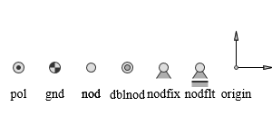
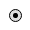
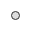
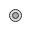
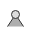
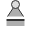
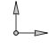

# g2.ext.js #

[See the API Reference](https://github.com/goessner/g2/blob/master/docs/api/g2.ext.md)

### g2 extension for expanded functionality ##

g2.ext adds properties that can be used on standard g2 elements, which is used in extensions like `label` and `mark`, as well as in other extensions like `g2.mec.js`.

#### get the length of a line in `label`

```javascript
    g2().view({cartesian:true})
        .lin({x1:10,y1:10,x2:90,y2:90,ld:[6,3], label:`@len`})
```


How `label` works is shown further below on this page.

### Splines

g2.ext.js introduces a new method that draws splines by points by
implementing a centripetal Catmull-Rom spline (thus avoiding cusps and self-intersections).

The `spline` command expects an object with a `pts` property analogous to the
[ply](https://github.com/goessner/g2/wiki/Elements#ply-element) method from g2.js.
This property can have different formats, for each of which there must be provided an individual
array iterator. _g2_ implements three standard iterators which need not be specified by the last `itr` argument.

Property Format | comment
-------- | -------
`{pts:[x1,y1,x2,y2,...,xn,yn]}` | Flat array of `x` and `y` values [default].
`{pts:[[x1,y1],[x2,y2],...,[xn,yn]]}` | Array of arrays of `x` and `y` values.
`{pts:[{x:x1,y:y1},{x:x2,y:y2},...,{x:xn,y:yn}]}` | Array of objects with `x` and `y` members.

Another property of `string` is `closed` which can have boolean values `true` and `false`, which are interpreted as closed flags (also analogous to `ply`).

```javascript
g2().style({ls:"red",lw:3,fs:"#ddd"})
    .spline([10,10,40,70,60,30,90,80])
    .spline([[110,10],[140,70],[160,30],[190,80]],true)
    .spline([{x:210,y:10},{x:240,y:70},{x:260,y:30},{x:290,y:80}],'split');
```


Other resources on splines:
 * [cubic hermite spline](https://en.wikipedia.org/wiki/Cubic_Hermite_spline)
 * [bézier curves](https://pomax.github.io/bezierinfo/)

### Labels

If you want to add text to a geometric element, you can always use the basic `txt` element. 
However, some element types support the smarter `label` property, which comes with a more intuitive relative positioning concerning its nearest previous element.
Reliable positioning always requires *cartesian* coordinates.

> Please note that with `g2` version 3 labels as element have been deprecated in favor of usage as property.

Property | Meaning
:--------: | :--------:
`label: {str,loc,off}` | Label element placing string `str` at location `loc` using offset `off`.
`label: str` | Same, but with `loc` set to `'se'` and off to `1`.

Point-like and rectangular elements provide locations according to cardinal directions.Linear elements provide parameterized numerical or named locations.

| Type  | Elements | default | locations | offset | img |
| :-----: | :------: | :-----: | :-----: | :-----: | :-----: |
| Point elements | `cir, use` | `c` |`c`<br>`e,ne,n,nw,w,sw,s,se`<br>angle in [radians] | number |  |
| Rectangular elements | `rec, slider` | `c` |`c`<br>`e,ne,n,nw,w,sw,s,se` | number |  |
| Linear elements | `lin, vec, dim`<br>`arc, adim`<br>`spring, damper`<br> `bar, bar2`| `0.5` | `beg, mid, end`<br> normalized numerical parameter | `left, right`<br>number | 
| Polygonial elements | `ply, ground`<br>`link, link2` | `0.5` | `beg, end`<br> `#index` <br> normalized numerical parameter | `left, right`<br>number | 
| Spline element | `spline` | `beg` | `beg, end`<br> `#index` | `left, right`<br>number | 

A numerical offset always means *outside* of closed shapes with regard to the specified point.
With linear, polygonial and spline elements a positive value means *right of* and a negativ value means *left of*
the line at the specified point. If there is no offset distance specified, the global `g2.State.labelOffset`'s value is taken. Please note, that cardinal locations are not sensitive to transformations.
### Markers

Markers can be placed onto the outline of an element.

> Please note that with `g2` version 3 marks as element have been deprecated in favor of usage as property.

Element | Meaning
:--------: | :--------:
`mark:{mark,loc||count}` | Marker element placing marker symbol `mark` at locations `loc`. If `count` is given instead of `loc`, the marks are distributed evenly on the respective element.
`mark:loc||count` | Same, but with mark set to `"tick"` as default.

Elements with a unique center and rectangular elements provide locations according to the cardinal directions.
Linear elements provide parameterized numerical or named locations.
The `spline` element only supports indexed locations.
It does not support parameterized locations.

Locations can also be passed as arrays, which makes it convenient for multiple marks with the same `mark` to be just passed in one calling of the mark method e.g `mark({mark:"tick",loc:[0,0.25,"mid",0.9]})`

Default symbols are `"tick"`, `"sqr"` and `"dot"`.

| Type  | Elements | default | locations |dir | img |
| :-----: | :------: | :-----: | :-----: | :-----: | :-----: |
| Centered elements | `cir` | `c` | `c`<br>`e,ne,n,nw,w,sw,s,se`<br>normalized parameter | `-1,0,1` |  |
| Rectangular elements | `rec, slider` | `c` | `c`<br>`e,ne,n,nw,w,sw,s,se` | `-1,0,1` |  |
| Linear elements | `lin, vec, dim`<br>`arc, avec, adim`<br>`spring, damper`<br> `bar, bar2`| `0.5` | `beg, mid, end`<br> normalized numerical parameter | `-1,0,1` | 
| Polygonial elements | `ply, ground`<br>`link, link2` | `0.5` | `beg, end, mid, all`<br> `#index` <br> normalized numerical parameter |`-1,0,1` | 
| Spline element | `spline` | `beg` | `beg, end, mid, all`<br> `#index` |`-1,0,1` | 

### Symbols ###


These symbols expect `cartesian` mode to be true, notable when using `nodfix`, `nodflt` and `origin`.

Some useful symbols implemented into `g2.ext.js` are:

Element | Image | Meaning
-------- | -------- | ------
`pol({x,y})` |  | Creates a pol symbol.
`gnd({x,y})` |  | Creates a gnd symbol.
`nod({x,y})` |  | Creates a nod symbol.
`dblnod({x,y})` |  | Creates a dblnod symbol.
`nodfix({x,y})` |  | Creates a nodfix symbol.
`nodflt({x,y})` |  | Creates a nodflt symbol.
`origin({x,y})` |  | Creates a origin symbol.

### Helpful elements

`g2.ext.js` also provides some extra elements that are based on `core` elements:

Element | Image | Meaning
-------- | -------- | ------
`vec({x1,y1,x2,y2})` |  | Linear vector element which starts at `x1, y1` and points to `x2, y2`.
`avec({x,y,r,w,dw})` |  | Angular vector element with center at `x, y`, radius `r` and spans a vectro from `w` to `w+dw`.
`dim({x1,y1,x2,y2,inside})` |  |  Linear dimension element which starts at `x1, y1` and points to `x2, y2`.
`adim({x,y,r,w,dw,inside})` |  |  Arc dimension element by center coordinates `x`, `y`, radius `r`, start angle `w` and angular range `dw`.

### Styles

There are some predefined colors, line styles and other constants.
They can be overwritten if needed.

| Name | Type | Default | Description |
| --- | --- | --- | --- |
| State | <code>object</code> |  | `g2` state namespace. |
| State.nodcolor | <code>string</code> | <code>&quot;#333&quot;</code> | node color. |
| State.nodfill | <code>string</code> | <code>&quot;#dedede&quot;</code> | node fill color. |
| State.nodfill2 | <code>string</code> | <code>&quot;#aeaeae&quot;</code> | alternate node fill color, somewhat darker. |
| State.linkcolor | <code>string</code> | <code>&quot;#666&quot;</code> | link color. |
| State.linkfill | <code>string</code> | <code>&quot;rgba(200,200,200,0.5)&quot;</code> | link fill color, semi-transparent. |
| State.solid | <code>array</code> | <code>[]</code> | solid line style. |
| State.dash | <code>array</code> | <code>[15,10]</code> | dashed line style. |
| State.dot | <code>array</code> | <code>[4,4]</code> | dotted line style. |
| State.dashdot | <code>array</code> | <code>[25,6.5,2,6.5]</code> | dashdotted line style. |
| State.labelOffset | <code>number</code> | <code>5</code> | default label offset distance. |
| State.labelSignificantDigits | <code>number</code> | <code>3</code> | default label's significant digits after floating point. |
