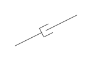
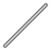
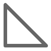
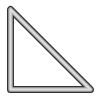
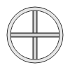
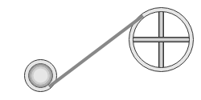
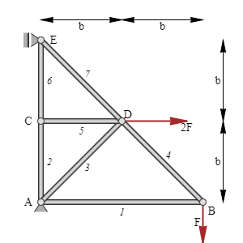

[](https://github.com/goessner/g2/blob/master/LICENSE)
[](https://www.npmjs.com/package/g2d-mec)
[](https://www.npmjs.com/package/g2d-mec)

# g2.mec.js #

[See the API Reference](https://github.com/goessner/g2/blob/master/docs/api/g2.mec.md)

## g2 extension for mechanical applications ##

Some of these elements use functions of `g2.ext`, so it is advisable to prepend `g2.ext` before using `g2.mec`.

### Mechanical Elements ###

`g2.mec.js` also provides some mechanical elements.

Element | Image | Meaning
-------- | -------- | ------
`slider({x,y,w,b,h})` |  |  Slider element by center coordinates `x, y` and rotation angle `w` with breadth `b` and height `w`.
`spring({x1,y1,x2,y2})` |  |  Symbolical Spring element which starts at `x1, y1` and points to `x2, y2`.
`damper({x1,y1,x2,y2})` |  |  Symbolical Damper element which starts at `x1, y1` and points to `x2, y2`.
`ground({pts,pos,h,closed})` |  |  Polygonial ground element by points array `pts`, `pos` for which side the ground is [`left, right`], `h` for width of the ground and closed flag `closed`[`true, false`] .
`bar({x1,y1,x2,y2})` |  |  Bar element which starts at `x1, y1` and points to `x2, y2`.
`bar2({x1,y1,x2,y2})` |  |  Alternate Bar2 element which starts at `x1, y1` and points to `x2, y2`.
`link({pts})` |  |  Link element by points array `pts`, which is always `closed`.
`link2({pts})` |  |  Alternate Link2 element by points array `pts`, which is always `closed`.
`beam({pts})` |  |  Beam element by points array `pts`, which is never `closed`.
`beam2({pts})` |  |  Alternate Beam2 element by points array `pts`, which is never `closed`.
`load({pts,spacing,w})` |  |  Load element by points array `pts` and spacing `spacing` between vectors. Accepts styling for vectors.
`pulley({x,y,r})` |  |  Pulley element by center point `x, y` and radius `r`.
`pulley2({x,y,r})` |  |  Pulley2 element by position `x, y` including rotation angle `w` and radius `r`.
`rope({x1,y1,r1,x2,y2,r2})` |  |  Rope element tangential to two circles with given center points `p1`[`{x, y}`] and `p2`[`{x, y}`] and radii `r1` and `r2`. You can switch between the four possible tangents by the sign of the radii.

### Truss Example

You can see a simple truss below, composed from mechanical symbols and elements.


```js
// g2.mec truss example ...
    function dxdy(a,dx,dy) {
        return {
            x1: a.x, y1: a.y,
            x2: a.x + dx, y2: a.y + dy
        }
    }
    const A = {x:50,y:50},  B = {x:250,y:50},
        C = {x:50,y:150}, D = {x:150,y:150},
        E = {x:50,y:250},
        g = g2()
            .view({cartesian:true})
            .link2({pts:[A,B,E,A,D,C]})
            .vec({...dxdy(B,0,-50),lw:2,ls:"darkred"})
            .vec({...dxdy(D, 80,0),lw:2,ls:"darkred"})
            .nodfix(A)
            .nod(B)
            .nod(C)
            .nod(D)
            .nodflt({...E, w:-Math.PI/2})
            .exe(document.getElementById("c").getContext("2d"));
```


### Truss Example with Labels

The truss example above can now be improved by adding labels.



```javascript
  // g2.mec truss example with labels ...
    function dxdy(a,dx,dy) {
        return {
            x1: a.x, y1: a.y,
            x2: a.x + dx, y2: a.y + dy
        }
    }
    function x1x2(a,b) {
        return {
            x1: a.x, y1: a.y,
            x2: b.x, y2: b.y
        }
    }
    const A = {x:50,y:50}, B = {x:250,y:50},
        C = {x:50,y:150}, D = {x:150,y:150},
        E = {x:50,y:250},
        g = g2()
            .view({cartesian:true})
            .beg({font: "italic 400 12px Unknown Font"})
            .bar2(x1x2(A,B)).label({str:"1",off:5})
            .bar2(x1x2(A,C)).label({str:"2",off:5})
            .bar2(x1x2(A,D)).label({str:"3",off:15})
            .bar2(x1x2(B,D)).label({str:"4",off:15})
            .bar2(x1x2(C,D)).label({str:"5",off:5})
            .bar2(x1x2(C,E)).label({str:"6",off:5})
            .bar2(x1x2(D,E)).label({str:"7",off:15})
            .end()
            .vec({...dxdy(B,0,-50),lw:2,ls:"brown"}).label({str:"F",loc:0.5})
            .vec({...dxdy(D,80,0),lw:2,ls:"brown"}).label({str:"2F",loc:"end"})
            .nodfix(A).label({str:"A",loc:"w",off:5})
            .nod(B).label({str:"B",loc:"se",off:15})
            .nod(C).label({str:"C",loc:"w",off:5})
            .nod(D).label({str:"D",loc:"ne",off:5})
            .nodflt({...E, w:-Math.PI/2}).label({str:"E",loc:"e",off:5})
            .dim(dxdy({x:A.x,y:275},100,0)).label({str:"b"})
            .dim(dxdy({x:D.x,y:275},100,0)).label({str:"b"})
            .dim(dxdy({x:275,y:E.y},0,-100)).label({str:"b"})
            .dim(dxdy({x:275,y:D.y},0,-100)).label({str:"b"})
            .exe(document.getElementById("c").getContext("2d"));
```